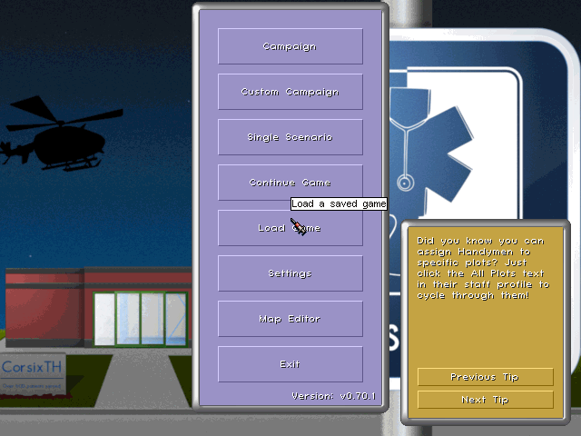
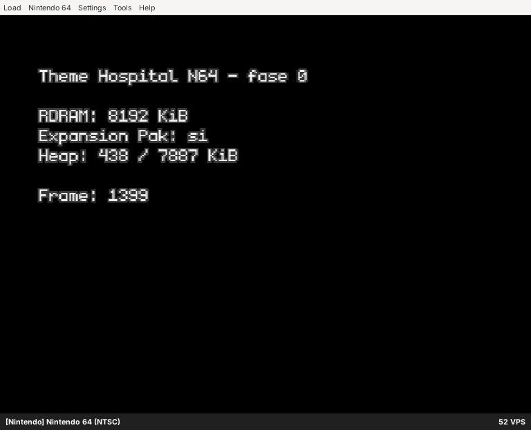
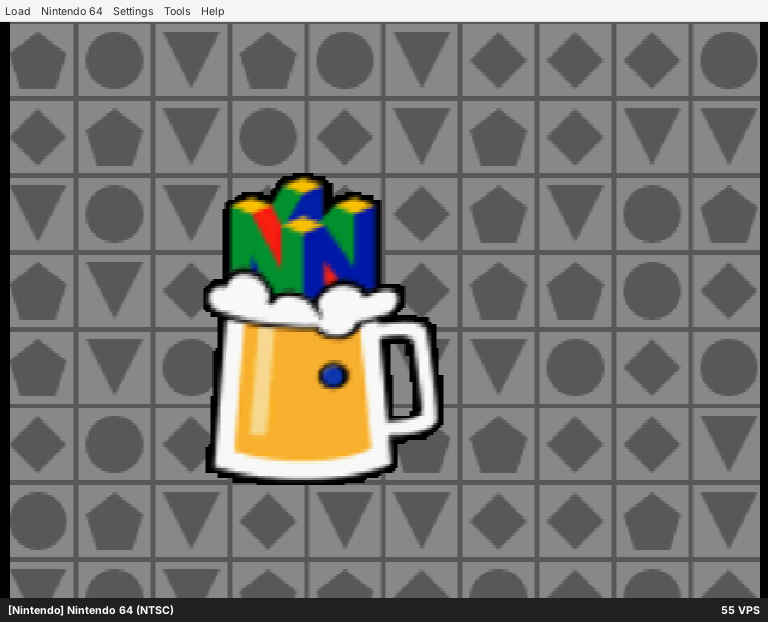

# Fase 0 — Entorno

Fecha: 2026-10-09. Estado: **cerrada**. Todo lo que pide el plan está instalado y verificado, con tres desviaciones justificadas (ver [Desviaciones respecto al plan](#desviaciones-respecto-al-plan)).

| Paso del plan | Resultado |
|---|---|
| 1. CorsixTH con Tracy y símbolos de depuración | v0.70.1, `RelWithDebInfo`, `WITH_TRACY=ON`. Arranca con los datos originales y `tracy-capture` registra la sesión. |
| 2. `TH_DATA_DIR` con los datos | CD original de 1997 extraído en `$TH64_WORK/data/HOSP`, fuera del repo. |
| 3. libdragon, ares, heaptrack/massif | libdragon `preview` + toolchain GCC 16.2.0, ares v148 (solo núcleo N64), heaptrack 1.5.0 y valgrind 3.22.0 (massif). |
| 4. Hola mundo y un ejemplo en ares | `n64/hello` y el ejemplo `rdpqdemo` de libdragon se ejecutan; capturas y salida de ISViewer abajo. |

## Máquina

Contenedor en la nube de Claude Code. Es efímero: todo lo que no esté en el repo se pierde entre sesiones, por eso existe `tools/setup.sh`.

| | |
|---|---|
| SO | Ubuntu 24.04.5 LTS, kernel 6.18.44 |
| CPU | Intel Xeon @ 2,10 GHz (virtualizada), 4 vCPU, 1 hilo por núcleo |
| RAM | 15 GiB |
| GPU | Ninguna. OpenGL por llvmpipe y Vulkan por lavapipe (Mesa 25.2.8) |
| Pantalla | Ninguna. Xvfb 21.1.12 |

La CPU importa para la fase 1: el factor de conversión a la VR4300 se calculará sobre esta CPU virtual, que además comparte host y puede variar entre sesiones.

## Versiones fijadas

| Componente | Versión | Origen exacto |
|---|---|---|
| CorsixTH | v0.70.1 | commit `56bd5d00f76331c7f76d7b696726a7926303ca0c` (2026-08-26) |
| Tracy (cliente y `tracy-capture`) | v0.13.1 | commit `05cceee0df3b8d7c6fa87e9638af311dbabc63cb`; la misma versión que fija el baseline de vcpkg de CorsixTH v0.70.1 |
| Lua | 5.4.6 | Ubuntu `liblua5.4-dev 5.4.6-3build2` |
| SDL2 / SDL2_mixer | 2.30.0 / 2.8.0 | Ubuntu `libsdl2-dev 2.30.0+dfsg-1ubuntu3.1`, `libsdl2-mixer-dev 2.8.0+dfsg-1build3` |
| FreeType | 2.13.2 | Ubuntu `libfreetype-dev 2.13.2+dfsg-1ubuntu0.2` |
| luafilesystem / LPeg | 1.8.0 / 1.0.2 | Ubuntu `lua-filesystem 1.8.0-3`, `lua-lpeg 1.0.2-2` |
| Toolchain N64 | GCC 16.2.0, binutils 2.45 | paquete `gcc-toolchain-mips64 16.2.0.34909605681` de la release `toolchain-continuous-prerelease` de libdragon, SHA-256 `fac8e6572493a66468b7d45df41b042f90b1a630ec96aa218bd5fb1f320a0a4d` |
| libdragon | rama `preview` | commit `39d0d6096130836a65710da6730290701d060272` (2026-09-15) |
| ares | v148 | commit `0aafd85789215e84e1e43415c07d4c88461b7899`; dependencias precompiladas `ares-deps` 2026-04-23 |
| heaptrack | 1.5.0 | Ubuntu `1.5.0+dfsg1-2ubuntu3` |
| valgrind (massif) | 3.22.0 | Ubuntu |
| innoextract | 1.9 | Ubuntu `1.9-0.1build1` (para el instalador de GOG; no se ha necesitado) |
| 7-Zip | 23.01 | Ubuntu `p7zip-full 16.02+transitional.1`; extrae la ISO |
| Compilador del host | GCC 13.3.0, CMake 3.28.3, Ninja 1.11.1 | Ubuntu |

La release `toolchain-continuous-prerelease` de libdragon se regenera con cada cambio de la toolchain. `tools/setup.sh` comprueba el SHA-256 y avisa si ha cambiado, pero no aborta; en ese caso hay que anotar aquí la nueva versión.

## Decisiones

### CorsixTH: release v0.70.1, no `master`

- Es la última release (2026-08-26). Las partidas de referencia de la fase 1 se crearán en un PC con el instalador oficial de esa misma versión; si se midiera `master`, habría que compilarlo también allí.
- v0.70.1 usa **SDL2**. El paso a SDL3 que menciona el plan solo está en `master` (commit `e6555700…` del 2026-10-07). Para medir Lua y la simulación da igual. Para la fase 3 (qué partes de C++ dependen de SDL) se leerá `master`, que es lo que habría que portar.

### libdragon: rama `preview`, no `trunk`

| | `trunk` | `preview` |
|---|---|---|
| Último commit | 2026-09-15 | 2026-09-15 |
| Commits que no están en la otra rama | 281 (sobre todo backports) | 4.609 |
| Punto de divergencia | 2024-05-26 | 2024-05-26 |
| Cabeceras propias | `dfsinternal.h` | 56 ficheros `.h` más el directorio `GL/` (OpenGL), entre ellos `mid64.h`, `midi_target.h`, `sf64.h`, `sf64_synth.h`, `profile.h`, `rspq_profile.h`, `kernel.h`, `video_sync.h`, `vi.h`, `fmv.h` |
| Herramientas propias | — | `videoconv64`, `mkmodel`, `mkmaterial`, `rdpvalidate`, `cpaktool`… |

Se elige `preview` por tres razones:

1. **Es un superconjunto con las mismas garantías para lo estable.** En `preview` hay una sola libdragon. Cada API está marcada como estable o preview, y las preview están **bloqueadas por defecto**: usarlas es un error de compilación salvo que el proyecto ponga `LIBDRAGON_PREVIEW = 1` en su Makefile. El código que solo usa APIs estables se comporta igual en las dos ramas.
2. **Música.** Theme Hospital guarda la música en XMI (variante de MIDI). `preview` trae un reproductor de secuencias (`mid64`) y un sintetizador de SoundFont (`sf64`). `trunk` no trae nada parecido.
3. **Medición.** `preview` incluye `profile.h` y `rspq_profile.h`, útiles para el hito 5 de la fase 5.

`n64/hello` usa solo APIs estables. Los campos `free` y `fragmentation` de `heap_stats_t` son preview, así que no se usan.

### ares: solo el núcleo de N64

Se compila con `-DARES_CORES=n64` para ahorrar tiempo. Vídeo por GLX (llvmpipe) y el RDP por paraLLEl-RDP sobre Vulkan por software (lavapipe). Las salidas de audio e input por SDL quedan desactivadas porque ares v148 busca SDL3 y Ubuntu 24.04 no lo empaqueta; sin pantalla no hacen falta.

## Desviaciones respecto al plan

1. **CorsixTH sin vcpkg.** La política de red de este entorno responde **403** a las descargas `https://github.com/<repo>/archive/…`. vcpkg descarga así casi todas sus dependencias: la primera en fallar fue `opus` (`github.com/xiph/opus/archive/v1.5.2.tar.gz`). `git clone` y las descargas de releases de GitHub sí funcionan. Por eso:
   - CorsixTH se compila con las mismas opciones que el preset `linux-tracy`, pero contra las bibliotecas de Ubuntu (la ruta de su `Dockerfile.build`).
   - Tracy se compila desde `git clone` en la misma versión (0.13.1) que habría puesto vcpkg.
   - **Consecuencia para la fase 1:** el baseline de vcpkg de v0.70.1 instala **Lua 5.5.0**, y es la versión de las compilaciones con vcpkg (el CI de CorsixTH tiene un trabajo «Linux vcpkg Lua 5.5»). Aquí tenemos **Lua 5.4.6**. CorsixTH admite ambas: su CI también prueba Lua 5.1 y LuaJIT. Lua 5.5 cambia la representación interna de los arrays, así que el heap de Lua puede no coincidir entre las dos versiones. Antes de medir hay que decidir con cuál (o con ambas). Ver *Pendiente*.
   - En una máquina sin esa restricción, el preset original funciona tal cual: `VCPKG_ROOT=/opt/vcpkg cmake --preset linux-tracy -DWITH_MOVIES=OFF -DWITH_UPDATE_CHECK=OFF -DWITH_MIDI_DEVICE=OFF -DENABLE_UNIT_TESTS=OFF`. Para que funcione aquí, hay que permitir esas descargas en *Network access* del entorno (<https://code.claude.com/docs/en/cloud-environments#network-access>).
2. **Datos del CD de 1997, no del instalador de GOG.** El instalador de GOG ocupa unos 200 MB y no se puede subir a la sesión (límite de 30 MB). Se usa la imagen del CD original europeo (ver [Datos](#datos-del-juego-th_data_dir)). `innoextract` queda instalado para quien parta del instalador de GOG.
3. **Opciones desactivadas en CorsixTH:** vídeos (`WITH_MOVIES`; el FMV está fuera de alcance), comprobación de actualizaciones, dispositivos MIDI y tests unitarios. Ninguna afecta a la simulación.

## Datos del juego (`TH_DATA_DIR`)

- **Origen:** zip de 225.176.309 bytes, MD5 `0121bd75de29d407554d801fcc5d088e`. Contiene la imagen del CD (`Theme Hospital (1997)(Electronic Arts)(M6).iso`, 213.278.720 bytes, una sola pista de datos `MODE1/2048`, etiqueta de volumen `THEME HOSPITAL BETA FIVE 13-5-9`). Es la edición europea en 6 idiomas: inglés, francés, alemán, italiano, español y sueco.
- **La URL no está en el repo.** `tools/setup.sh data` la lee de `TH_DATA_URL` (o de `TH_DATA_ZIP` si el zip ya está en local) y comprueba el MD5 si se da `TH_DATA_MD5`.
- **Validación:** la carpeta `HOSP` contiene los ficheros que CorsixTH exige (`DATA/VBLK-0.TAB`, `LEVELS/LEVEL.L1`, `QDATA/SPOINTER.DAT`). Los vídeos que CorsixTH comprueba tienen exactamente el tamaño esperado para la versión completa, por ejemplo `INTRO/INTRO.SM4` con 33.616.520 bytes. CorsixTH arranca con ellos sin avisos de ficheros dañados.
- **Tamaño en disco de `HOSP`:** 186,70 MB. El resto de la ISO, hasta 211,6 MB, son instaladores y DirectX. Desglose:

  | Carpeta | MB | Ficheros |
  |---|---:|---:|
  | `SOUND` (6 `SOUND-x.DAT` de 13–17 MB, uno por idioma; 8 XMI de música que suman 0,10 MB; drivers de sonido de DOS) | 86,41 | 52 |
  | `INTRO` (vídeos) | 56,27 | 3 |
  | `ANIMS` (vídeos) | 33,35 | 32 |
  | `QDATA` | 3,00 | 205 |
  | `DATA` | 1,90 | 30 |
  | `DATAM` | 1,50 | 20 |
  | `LEVELS` | 0,85 | 104 |
  | `QDATAM` | 0,05 | 11 |
  | Ejecutables, DLL y configuración (raíz de `HOSP`) | 3,36 | 9 |

  Sin vídeos y con un solo idioma de sonido (`SOUND-0.DAT`) quedan 24,15 MB. El inventario completo, con formatos y tamaños descomprimidos, es trabajo de la fase 2.

## Verificación

### CorsixTH + Tracy + heaptrack

`tools/run_corsixth.sh` lo lanza bajo Xvfb con audio desactivado y una configuración generada a partir de `TH_DATA_DIR`.



| Prueba (en el menú principal) | Primera instalación | Reinstalación con `tools/setup.sh` |
|---|---|---|
| `tracy-capture`, 20 s | 541.765 zonas en 16,02 s; traza de 2,6 MB | 564.515 zonas en 16,04 s; traza de 2,5 MB |
| heaptrack, 15 s: llamadas de reserva de memoria | 802.743 | 877.630 |
| heaptrack: pico de heap | 90,87 MB | 93,82 MB |
| heaptrack: pico de RSS (incluye la sobrecarga de heaptrack) | 244,39 MB | 247,75 MB |

La misma prueba varía un 3–4 % entre ejecuciones. Para la fase 1 habrá que repetir cada medición varias veces y dar el rango, no un único valor.

Las cifras de heaptrack solo demuestran que la herramienta funciona; **no son una medición de la fase 1**. Corresponden al menú, no a una partida, e incluyen las reservas de SDL y del renderizador por software de Mesa, que en la N64 no existen. La fase 1 tendrá que separar por subsistema.

### N64 en ares

`tools/run_ares.sh` lanza una ROM bajo Xvfb, guarda la salida de ISViewer (`debugf`) y hace una captura de la ventana.

**`n64/hello`** muestra la RAM que ve la consola, el heap de libdragon y la tasa de frames medida con el reloj de la consola emulada (`get_ticks_ms`), no con el del host:

```
# Con Expansion Pak
TH64 hola: RDRAM 8192 KiB, Expansion Pak si, heap 438/7887 KiB
TH64 hola: frame 300, 59.9 fps
TH64 hola: frame 600, 59.8 fps
...
# Sin Expansion Pak (--no-expansion)
TH64 hola: RDRAM 4096 KiB, Expansion Pak no, heap 438/3791 KiB
TH64 hola: frame 300, 59.8 fps
```



El heap ya ocupado (438 KiB) incluye los dos framebuffers de 320×240 a 16 bits (300 KiB) y las estructuras de rdpq. La ROM ocupa 192 KiB.

**Ejemplo `rdpqdemo`** de libdragon (sprites con el RDP, cargados del sistema de ficheros DFS):



### Advertencias sobre ares en este entorno

- **El tiempo del host no sirve para medir.** ares sobre lavapipe tarda en arrancar (compila shaders de Vulkan; uno tardó 252 ms) y no siempre va a tiempo real: `rdpqdemo` marcó 55 VPS en lugar de 60, y libdragon avisó 8 veces de `__vblank_interrupt outside of vblank period`. Los fps se miden en tiempo de la consola emulada, como hace `n64/hello`. Las cifras de rendimiento del hito 5 de la fase 5 conviene confirmarlas también en hardware real.
- **ISViewer solo funciona con ROMs de hasta `0x03FF0000` bytes** (63,94 MiB). Por encima, ares no crea el dispositivo y `debugf` no saca nada (`ares/n64/cartridge/cartridge.cpp`). Si la ROM de desarrollo se acerca a 64 MB, habrá que registrar por otro canal o dejar los datos fuera de la ROM de depuración.

## Problemas encontrados

| Problema | Causa | Solución |
|---|---|---|
| vcpkg no puede descargar dependencias | 403 de la política de red en `github.com/<repo>/archive/…` | Bibliotecas de Ubuntu y Tracy desde `git clone` (ver arriba) |
| CorsixTH se cierra al arrancar: `app.lua:1157: attempt to index a nil value (local 'value')` | Si `player_name` está vacío, `fixConfig` lo rellena con `$USER` o `$USERNAME`, y en este contenedor no existe ninguna de las dos variables | Fijar `player_name` en la configuración (lo hace `tools/run_corsixth.sh`). Es un fallo de CorsixTH que se podría reportar |
| `librashader` no encontrado al configurar ares | Biblioteca opcional para shaders de postprocesado | Ninguna; no hace falta |

## Tiempos de instalación

En este contenedor (4 vCPU). La primera columna es la instalación a mano. La segunda es una reinstalación completa con `tools/setup.sh` en un directorio de trabajo nuevo, con `CCACHE_DISABLE=1` para que no reutilice compilaciones anteriores:

| Paso | Primera instalación | `tools/setup.sh` |
|---|---:|---:|
| Paquetes de Ubuntu | 28 s | 1 s (ya instalados) |
| Datos: descomprimir el zip, extraer la ISO y copiar `HOSP` | — | incluido en el total |
| Tracy, cliente | 12 s | 12 s |
| Tracy, `tracy-capture` | 110 s (2 trabajos) | 99 s (4 trabajos) |
| CorsixTH, configurar y compilar | 1 s + 11 s | 0 s + 10 s |
| Toolchain de libdragon, `dpkg -i` (más la descarga de 105 MB) | — | 3 s |
| libdragon `preview` con sus 38 ejemplos | 148 s (`JOBS=2`) | 86 s (`JOBS=4`) |
| ares v148, solo N64 | 5 s + 213 s | 5 s + 201 s |
| **Total de `tools/setup.sh`** | | **432 s** |

La reinstalación produjo los mismos resultados:
- los datos extraídos con 7-Zip son idénticos, fichero a fichero, a la primera extracción (467 ficheros);
- `n64/hello` dio las mismas cifras de RAM, heap y fps;
- `rdpqdemo` mostró las mismas 8 advertencias de VI;
- CorsixTH arrancó con los dos modos de `tools/run_corsixth.sh`.

## Cómo reproducirlo

En una sesión nueva (Ubuntu 24.04 x86_64, como root):

```bash
git clone <este repo> && cd Theme-Hospital-to-N64
export TH_DATA_URL='<URL del zip con los datos>'          # no se guarda en el repo
export TH_DATA_MD5=0121bd75de29d407554d801fcc5d088e       # opcional; este es el del CD usado aquí
tools/setup.sh                                            # apt, datos, CorsixTH+Tracy, libdragon, ares
source tools/env.sh

# CorsixTH: 20 s en el menú con traza de Tracy, o con heaptrack
tools/run_corsixth.sh out/menu 20
tools/run_corsixth.sh --heaptrack out/menu-heap 15

# N64: compilar el hola mundo y ejecutarlo con y sin Expansion Pak
make -C n64/hello
tools/run_ares.sh n64/hello/th64hello.z64 out/hello 30
tools/run_ares.sh n64/hello/th64hello.z64 out/hello-4mb 12 --no-expansion
tools/run_ares.sh "$TH64_WORK/src/libdragon/examples/rdpqdemo/rdpqdemo.z64" out/rdpqdemo 15
```

Se puede ejecutar un solo paso (`tools/setup.sh data`, `tools/setup.sh ares`…). Todo se instala fuera del repo:

| Ruta | Contenido |
|---|---|
| `$TH64_WORK` (por defecto `~/th64-work`) | código fuente, compilaciones, datos y logs |
| `/opt/libdragon` (`N64_INST`) | toolchain y libdragon |
| `/opt/tracy` | cliente de Tracy y `tracy-capture` |

Con los datos del instalador de GOG en lugar del CD: `innoextract -d gog setup_theme_hospital_*.exe`, comprimir la carpeta resultante en un zip y pasarlo con `TH_DATA_ZIP`. El paso `data` busca la carpeta que contiene `DATA/VBLK-0.TAB`.

## Pendiente para la fase 1

1. **Partidas de referencia.** Aquí no hay pantalla para jugar. Hay que crearlas con CorsixTH **v0.70.1** (<https://github.com/CorsixTH/CorsixTH/releases/tag/v0.70.1>) y guardarlas en `bench/saves/`. Se cargan sin pantalla con `CORSIXTH_SAVES=$PWD/bench/saves tools/run_corsixth.sh out/x 60 --load=<fichero>`; CorsixTH resuelve `--load` respecto a su directorio de partidas.
2. **Versión de Lua.** Decidir si se mide con 5.4.6 (la de Ubuntu, ya compilada) o con 5.5.0 (la de la release oficial), o con las dos. Compilar con 5.5.0 aquí obliga a compilar Lua, luafilesystem y LPeg desde `git clone`.
3. **Factor de CPU.** Documentar el factor frente a la VR4300 sobre esta CPU (Xeon virtualizada a 2,10 GHz) y repetir las mediciones varias veces para ver la variación entre ejecuciones.
