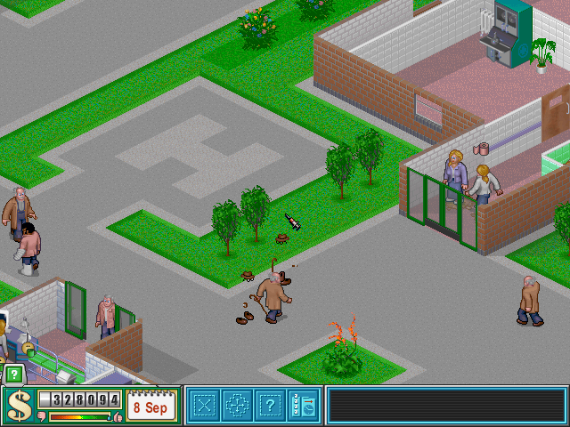
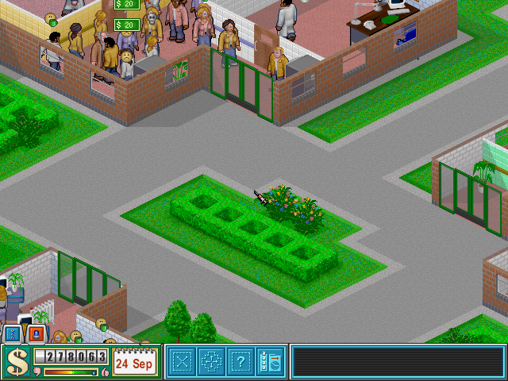

# Fase 1 — Mediciones de CorsixTH en PC

Fecha: 2026-10-09. Estado: **cerrada**. Máquina: la de `docs/00_entorno.md` (Xeon virtualizada a 2,10 GHz, 4 vCPU). Versión medida: CorsixTH v0.70.1 con Lua 5.4.6 y con Lua 5.5.0.

En todo el documento, 1 MiB = 1.048.576 bytes, la unidad natural para comparar con los 4 MiB de la N64 (8 MiB con Expansion Pak).

## Conclusión

**El estado de la simulación de CorsixTH, tal y como está, no cabe en 4 MiB, ni siquiera en 8 MiB, y la CPU de la N64 no podría moverlo.**

- **Memoria.** El heap vivo de Lua, tras un GC completo, ocupa entre **12,7 y 17,7 MiB** según la partida. Con el hospital vacío ya son 12,7–13,2 MiB, y solo el menú principal ocupa 8,8 MiB. Entre recolecciones, el heap llega a **26–43 MiB**. A eso se suman **15,5–18,2 MiB** de datos C++ propios de CorsixTH: sprites decodificados, texturas y mapa.
- **CPU.** Medido en ares, la VR4300 ejecuta Lua unas **400 veces más despacio** que la máquina de medición (rango 295–650× según el patrón de código). Simular a velocidad Normal costaría entre **6,6 veces la CPU entera de la N64** (hospital vacío) y **39 veces** (hospital lleno). En el hospital lleno, ni a la velocidad más lenta del juego (una hora de juego por segundo) daría abasto: necesitaría unos 2 s por hora de juego.
- **Lo que de verdad crece con el hospital** es poco: del inicio al lleno, el heap vivo de Lua sube 4,5 MiB para 887 entidades. En Lua, esa parte dinámica sola ya ocupa los 4 MiB del presupuesto. El resto son código, datos estáticos y estructuras por casilla, como el mapa de entidades (3,7 MiB en Lua para 128 × 128 casillas).

Esto descarta, con números, el camino 1 tal cual (ejecutar el Lua de CorsixTH en la N64). La decisión formal es de la fase 4; los datos que pesan para el camino 2 están en [Implicaciones para la decisión](#implicaciones-para-la-fase-4).

## Cómo se ha medido

### Arnés

CorsixTH arranca con `--interpreter=bench/th64bench.lua`, que carga el `CorsixTH.lua` original sin modificarlo y ejecuta un guion Lua dentro del bucle del juego (`bench/lib/th64.lua`). No se ha cambiado ni una línea de CorsixTH.

- **Tiempos con Tracy.** Cada evento del temporizador de SDL (cada 18 ms) se envuelve en una zona:
  - `th64_hora` si en ese evento se simula una hora de juego;
  - `th64_tick` si no;
  - `th64_frame` para el dibujo de cada frame.
- **Sin el hook de Lua.** CorsixTH con Tracy instala un hook de Lua que crea una zona en **cada** llamada a función; el arnés lo desactiva (`debug.sethook()`) para que no infle los tiempos.
- **Heap de Lua.** Se lee `collectgarbage("count")` después de cada hora simulada. Además se mide el heap vivo tras un GC completo, al principio y al final.
- **Heap de C++.** heaptrack 1.5 sobre un build sin Tracy, para que las colas del perfilador no cuenten. El pico se reparte por subsistema clasificando cada pila de llamadas (`bench/heaptrack_subsistemas.py`).
- **Campaña.** `tools/bench_medir.sh`: 3 partidas × 2 versiones de Lua × 3 repeticiones con Tracy (100 horas de juego de calentamiento y 500 medidas, a velocidad Normal y en tiempo real), más una pasada de heaptrack por partida y versión. Son 24 ejecuciones y 13 minutos, sin otras cargas en la máquina.

**Ritmo del juego.** El temporizador va a 18 ms (55,6 eventos/s). A velocidad Normal se simula una hora de juego cada 3 eventos: 18,5 horas por segundo y 37 eventos sin hora. Un día de juego tiene 50 horas.

### Partidas de referencia

Las tres partidas (`bench/saves/`) las ha creado el propio arnés con las ventanas y validaciones de la interfaz de CorsixTH (`bench/lib/builder.lua`). Construye habitaciones con `UIEditRoom`, coloca objetos con `UIPlaceObjects` y contrata como lo haría `UIPlaceStaff`. Si la interfaz rechaza una posición, prueba la siguiente; así nada se construye en un sitio donde un jugador no podría.

| Partida | Nivel | Fecha de juego | Pacientes (media en la medición) | Personal | Objetos | Basura | Habitaciones | Curados al guardar |
|---|---|---|---:|---:|---:|---:|---:|---:|
| `inicio` | 1 | 1-01-01, recién cargado | 0 | 0 | 2 (puertas de entrada) | 0 | 0 | 0 |
| `mediano` | 5 | 3-09-08 | 53,1 | 16 (9 médicos, 2 enfermeras, 4 conserjes, 1 recepcionista) | 96 | 403 | 9 | 119 |
| `lleno` | 12 | 1-09-24 | 307,8 | 57 (33 médicos, 10 enfermeras, 10 conserjes, 4 recepcionistas) | 305 | 208 | 36 | 52 |




Las partidas no son de un jugador humano. Para llegar a los tamaños pedidos se usaron opciones y trucos del propio juego, y todo queda registrado en `bench/resultados/resumen_*.json`:

- **Mediano:** nivel 5 con el terreno comprado. 2 consultas de medicina general, diagnóstico general, farmacia, psiquiatría, sala de hospitalización, inflación, sala de personal y aseos. Además, bancos, plantas, papeleras, máquina de bebidas y extintores.
- **Lleno:** nivel 12, el último de la campaña, con todo el terreno comprado y todo investigado (truco de investigación). 36 habitaciones de los 23 tipos.
- **Dinero:** en las dos se repone para no quebrar.
- **Reputación:** se pone al máximo cada mes, como un hospital bien llevado. Es el truco «max reputation».
- **Pacientes en el lleno:** el truco «Roujin's Challenge» de CorsixTH suma 40 pacientes al mes. Con él, la cifra se estabilizó en 310–330 a partir del mes 9; ese es el «máximo realista» de esta configuración. Al llegar a la meseta se lanzaron una emergencia y una epidemia, y las dos están **activas** en la partida guardada.
- **Política de sueldos:** se activó la política del juego que concede las subidas automáticamente. Sin ella, las peticiones sin atender acaban en despidos y el hospital se vacía de personal.
- **Final del nivel:** se vaciaron las condiciones de victoria y derrota del nivel para que la partida no termine sola al avanzar meses.
- **Faxes:** el arnés los contesta como un jugador que quiere un hospital activo: acepta emergencias y visitas VIP, encubre las epidemias para que sigan activas y arriesga el tratamiento si el diagnóstico es dudoso.

## Tiempo por hora de simulación

Medido con Tracy; media de 3 repeticiones de 500 horas de juego cada una. «Tick vacío» es un evento del temporizador sin hora nueva. «Simulación a velocidad Normal» suma, por segundo real, 18,5 horas y 37 ticks vacíos.

| Partida | Lua | Hora: media (rango de 3 rep.) | p95 | p99 | Máx. | Tick vacío | Simulación a velocidad Normal |
|---|---|---:|---:|---:|---:|---:|---:|
| inicio | 5.4 | 0,74 ms (0,71–0,76) | 0,97 ms | 1,46 ms | 5,5 ms | 0,080 ms | 16,6 ms/s (16,1–17,0) |
| inicio | 5.5 | 0,76 ms (0,73–0,79) | 1,00 ms | 1,62 ms | 4,5 ms | 0,079 ms | 17,1 ms/s (16,2–17,5) |
| mediano | 5.4 | 1,98 ms (1,87–2,11) | 2,87 ms | 5,97 ms | 42,5 ms | 0,106 ms | 40,6 ms/s (38,5–43,0) |
| mediano | 5.5 | 2,03 ms (1,91–2,09) | 2,89 ms | 5,85 ms | 36,6 ms | 0,103 ms | 41,4 ms/s (39,1–42,6) |
| lleno | 5.4 | 5,07 ms (4,94–5,16) | 10,03 ms | 23,89 ms | 33,0 ms | 0,109 ms | 97,9 ms/s (95,3–99,7) |
| lleno | 5.5 | 5,17 ms (5,08–5,24) | 9,84 ms | 21,79 ms | 30,8 ms | 0,104 ms | 99,6 ms/s (98,2–100,9) |

- **Dependencia del tamaño.** El coste por hora crece con el hospital: ×2,7 del inicio al mediano y ×6,9 del inicio al lleno.
- **Patrón diario.** El coste tiene un ciclo de 50 horas (un día de juego). En el lleno, una hora fija de cada día cuesta de media 20,6 ms, frente a 5,2 ms de media general; encaja con el cierre diario del juego. En el mediano destacan dos horas fijas del día, con unos 5 ms frente a 2,1. Los máximos absolutos (30–43 ms) son picos aislados. Para la N64, esto significa que el coste de la hora punta importa tanto como la media.
- **Lua 5.4 frente a 5.5.** Lua 5.5 tarda un 2–4 % más por hora, una diferencia dentro del ruido entre repeticiones.
- **Render.** El render (`th64_frame`, 10–12 ms por frame) se ha medido pero no es representativo: aquí dibuja Mesa por software (llvmpipe) y en la N64 lo haría el RDP.

## Heap de Lua

| Partida | Lua | Vivo tras GC completo | Muestreado: media | p95 | Máximo |
|---|---|---:|---:|---:|---:|
| inicio | 5.4 | 13,18 MiB | 19,47 MiB | 25,12 MiB | 25,80 MiB |
| inicio | 5.5 | 12,72 MiB | 21,75 MiB | 30,91 MiB | 32,08 MiB |
| mediano | 5.4 | 14,55 MiB | 19,65 MiB | 25,91 MiB | 26,75 MiB |
| mediano | 5.5 | 13,89 MiB | 21,45 MiB | 28,35 MiB | 29,13 MiB |
| lleno | 5.4 | 17,65 MiB | 25,35 MiB | 33,62 MiB | 34,80 MiB |
| lleno | 5.5 | 16,55 MiB | 28,89 MiB | 41,53 MiB | 43,00 MiB |

El heap vivo es idéntico en las 3 repeticiones (se parte siempre de la misma partida). El muestreado es lo que ocupa Lua con su recolector por defecto: la basura pendiente lo lleva al doble del vivo. Lua 5.5 tiene un heap vivo un 3,5–6,3 % menor, pero picos un 9–24 % mayores con sus parámetros de GC por defecto.

### De qué está hecho

Medido con `bench/host/codigo_lua.lua` (código) y `bench/scenarios/censo.lua` (recorrido del grafo de objetos, con tamaños estimados según el modelo de memoria de Lua 5.4):

| Concepto | Tamaño |
|---|---:|
| Menú principal, sin nivel cargado (heap vivo) | 8,81 MiB |
| — de ello, el código Lua de CorsixTH (274 ficheros; prototipos con bytecode, constantes y depuración) | hasta 2,81 MiB (1,21 MiB de bytecode sin depuración) |
| Nivel recién cargado con el hospital vacío (heap vivo) | 13,15 MiB (+4,34) |
| — de ello, `world.entity_map`: tablas por casilla (49.627 tablas para 128 × 128 casillas) | 3,74 MiB |
| Hospital mediano | 14,44 MiB (+1,29 sobre el inicio) |
| Hospital lleno: 887 entidades en el mundo (63.094 tablas) | 17,65 MiB (+4,50 sobre el inicio) |

El censo deja sin asignar 7,0–7,6 MiB, casi constantes entre partidas. Son el código, los upvalues, los userdata y el error de estimar el tamaño de las tablas, que Lua no expone. Las diferencias entre partidas sí son medidas exactas del heap vivo.

## Heap de C++ por subsistema

Pico de heaptrack, repartido por la primera función reconocible desde la hoja de cada pila. Valores en MiB.

| Categoría | inicio 5.4 | inicio 5.5 | mediano 5.4 | mediano 5.5 | lleno 5.4 | lleno 5.5 |
|---|---:|---:|---:|---:|---:|---:|
| Lua (intérprete) | 24,62 | 31,43 | 19,04 | 19,97 | 29,88 | 32,91 |
| Gráficos: sprites, animaciones y fuentes | 7,43 | 7,43 | 7,27 | 7,27 | 7,28 | 7,28 |
| Gráficos: texturas (SDL/driver) | 3,43 | 3,44 | 5,64 | 5,64 | 6,31 | 6,31 |
| Mapa y pathfinding | 4,50 | 4,50 | 4,50 | 4,50 | 4,50 | 4,50 |
| Carga de partida (persistencia) | 1,16 | 0,00 | 2,06 | 0,00 | 4,47 | 0,00 |
| Otros (sistema: SDL, libc, cargador…) | 0,10 | 0,10 | 0,10 | 0,10 | 0,10 | 0,10 |
| Vídeo: presentación y contexto (driver) | 98,09 | 98,09 | 77,60 | 77,60 | 82,11 | 82,23 |
| **Pico total** | 139,34 | 145,00 | 116,22 | 115,10 | 134,65 | 133,35 |
| **CorsixTH C++ sin driver, Lua ni carga** | 15,47 | 15,48 | 17,52 | 17,52 | 18,19 | 18,20 |

- **Driver de vídeo.** Son los búferes de Mesa/llvmpipe y del contexto OpenGL. Existen por renderizar por software en este entorno y no tienen equivalente en la N64.
- **Sprites, animaciones y fuentes.** Las hojas de sprites y las animaciones decodificadas ocupan 7,3–7,4 MiB fijos. En disco, todos los gráficos ocupan 6,5 MB comprimidos (`docs/00_entorno.md`); la fase 2 dirá cuánto ocupan sin comprimir y a 320×240.
- **Mapa.** `level_map` reserva 4,50 MiB para 128 × 128 casillas: unos 288 B por casilla.
- **Carga de partida.** En 5.4, el pico coincidió con la carga: son búferes temporales de deserialización. En 5.5 el pico cayó fuera de la carga.

## Factor de CPU

En lugar de suponer un factor, se ha medido con `tools/luabench.sh`. Los mismos microbenchmarks se ejecutan en el host y en una ROM de la N64 (`n64/luabench`), con Lua 5.4.6 y 5.5.0 compilados desde los mismos fuentes de lua.org con -O2. El tiempo de la N64 es el del reloj emulado por ares. Las sumas de control coinciden en todas las pruebas, así que los dos lados hacen el mismo trabajo.

| Prueba (patrón de CorsixTH que imita) | Host, Lua 5.4.6 | N64, Lua 5.4.6 | Cociente 5.4.6 | Cociente 5.5.0 |
|---|---:|---:|---:|---:|
| clases (metatablas, colas de acciones por entidad) | 27,4 ms | 9,37 s | 342× | 384× |
| tablas (recorridos y búsquedas) | 8,7 ms | 2,74 s | 316× | 353× |
| cadenas (`format`, `find`, `gmatch`) | 19,8 ms | 7,55 s | 381× | 422× |
| camino (búsqueda en anchura en Lua) | 7,3 ms | 2,16 s | 295× | 363× |
| gc (tablas pequeñas de vida corta) | 8,2 ms | 4,65 s | 570× | 649× |
| numérico (coma flotante doble) | 9,4 ms | 3,99 s | 425× | 339× |
| **Media geométrica (Lua)** | | | **378×** | **407×** |
| búsqueda en anchura **en C** (como el pathfinding C++) | 3,3 ms | 0,75 s | 227× | — |

**Calibrado del emulador.** Un bucle de 3 instrucciones que cabe en la caché da 93,46–93,75 MHz efectivos: la VR4300 a un ciclo por instrucción, como el hardware real. Leer 1 MiB línea a línea cuesta **763 ns por línea** de 16 B, unos 70 ciclos por fallo de caché.

El factor es muy superior al cociente de relojes (2,1 GHz / 93,75 MHz = 22×). La diferencia la explican la menor capacidad de ejecución por ciclo de la VR4300 y, sobre todo, los fallos de caché: 8 KiB de datos frente a una RDRAM de alta latencia, justo lo que más castiga a un intérprete y a su recolector. Una primera pasada con otra disposición de la ROM dio 409× y 401×: el factor tiene una incertidumbre de ±20 % por prueba.

**Factor usado para estimar:** 400× para Lua (rango 295–650×) y unas 225× para C.

## Estimación del coste en la N64

Tiempos del host multiplicados por el factor de Lua: 400×, con el rango 295–650× entre paréntesis.

| Partida | Lua | Una hora de juego en la N64 | CPU para simular a velocidad Normal | Horas de juego por segundo con el 100 % de la CPU |
|---|---|---:|---:|---:|
| inicio | 5.4 | 295 ms (217–479) | 6,6 × la CPU entera (4,9–10,8) | 3,4 (Normal = 18,5) |
| inicio | 5.5 | 306 ms (225–497) | 6,8 × (5,0–11,1) | 3,3 |
| mediano | 5.4 | 792 ms (584–1.288) | 16,2 × (12,0–26,4) | 1,3 |
| mediano | 5.5 | 812 ms (598–1.319) | 16,6 × (12,2–26,9) | 1,2 |
| lleno | 5.4 | 2.027 ms (1.495–3.294) | 39,2 × (28,9–63,6) | 0,49 (la más lenta = 1) |
| lleno | 5.5 | 2.069 ms (1.526–3.363) | 39,9 × (29,4–64,8) | 0,48 |

Suposiciones:
1. Todo el coste de la hora escala como el Lua medido. Parte del trabajo es C++ (pathfinding, mapa), que escala algo mejor (unas 225×), pero el grueso de la simulación de CorsixTH está en Lua.
2. No se cuenta el render, ni el audio, ni la lectura de cartucho.
3. ares reproduce bien la latencia de memoria de la consola. Está pendiente de validar en hardware real: la ROM `n64/luabench` también escribe los resultados en pantalla, para poder leerlos en una N64 con flashcart.

## Implicaciones para la fase 4

Datos medidos que condicionan la decisión:

- **Camino 1 (Lua de CorsixTH en la N64).** No es viable sin rehacer la representación de datos y el núcleo de la simulación. No cabe en memoria: 12,7–17,7 MiB de heap vivo y 26–43 MiB con la basura del GC, frente a 8 MiB. Tampoco llega en CPU: de 6,6 a 39 veces la VR4300 a velocidad Normal.
- **Volumen de la simulación.** Un hospital lleno tiene unas 900 entidades (314 pacientes, 57 empleados, 305 objetos y basura) y 36 habitaciones, sobre un mapa de 16.384 casillas. Es la cantidad de estado que tendría que guardar cualquier motor.
- **Estimación para un motor nativo (camino 2), no medida.** Con 256–512 B por entidad y 16–32 B por casilla, el estado de la simulación ocuparía 0,5–1 MiB. Eso dejaría margen dentro de 4 MiB para gráficos y audio. Hay que validarlo en las fases 3 y 5.
- **CPU de un motor nativo.** No se puede medir todavía. Como referencia: el juego original corría en PC con DOS y en PlayStation (R3000A a 33,9 MHz). La VR4300 es más rápida que esa CPU, pero aquí cada fallo de caché cuesta ~70 ciclos, así que la disposición de los datos importará tanto como el algoritmo.
- **Gráficos.** CorsixTH mantiene 7,3 MiB de sprites y animaciones decodificados más 3,4–6,3 MiB de texturas. En la N64 hará falta una caché de gráficos (como la caché LRU del port de Wii) o el formato nativo del RDP en vez de 32 bits. Es trabajo de las fases 2 y 3.

## Limitaciones

- **Ruido de la máquina.** La máquina de medición es virtual y compartida. Las 3 repeticiones dan rangos del 4–13 % en la media por hora; por eso se dan rangos y no un único valor.
- **Coste de instrumentar.** Las zonas de Tracy añaden unos microsegundos por evento, despreciable frente a los milisegundos de cada hora de juego.
- **Representatividad de las partidas.** Las partidas se han generado con los trucos descritos, no las ha jugado una persona. El «lleno» es el máximo de esta configuración (310–330 pacientes estables), no un máximo absoluto del motor.
- **Momento del pico de heaptrack.** Es el pico de toda la ejecución, que puede caer durante la carga. Por eso se da aparte la fila sin carga ni Lua.
- **Validez del factor de CPU.** Depende de que ares reproduzca bien los fallos de caché y la latencia de la RDRAM de la consola real.

## Cómo reproducirlo

```bash
tools/setup.sh                         # entorno completo, incluidos Lua 5.5 y los builds sin Tracy
source tools/env.sh

# Partidas (ya están en bench/saves/; regenerarlas da partidas parecidas, no idénticas)
tools/bench_run.sh bench/scenarios/crear_inicio.lua out/inicio
tools/bench_run.sh bench/scenarios/crear_mediano.lua out/mediano
tools/bench_run.sh bench/scenarios/crear_lleno.lua out/lleno

# Campaña de medición (unos 13 min) y resumen
tools/bench_medir.sh "$TH64_WORK/resultados/fase1" 3
python3 bench/analizar.py "$TH64_WORK/resultados/fase1" bench/resultados/fase1.json --factor-cpu 400

# Factor de CPU (host y ares) y composición del heap de Lua
tools/luabench.sh "$TH64_WORK/resultados/luabench" 5
tools/bench_run.sh bench/scenarios/censo.lua out/censo-lleno --load=lleno.sav
lua5.4 bench/host/codigo_lua.lua "$CORSIXTH_DIR/CorsixTH/Lua" english.lua
```

Los resultados resumidos están en `bench/resultados/`:
- `fase1.json`: tiempos, heap y entidades por repetición;
- `heaptrack/`: el desglose del heap de C++;
- `luabench.json`: el factor de CPU;
- `censo_*.json` y `codigo_lua.jsonl`: la composición del heap de Lua;
- `resumen_*.json`: cómo se crearon las partidas.

Las trazas de Tracy y los perfiles de heaptrack en bruto ocupan cientos de MB y se quedan fuera del repo.
