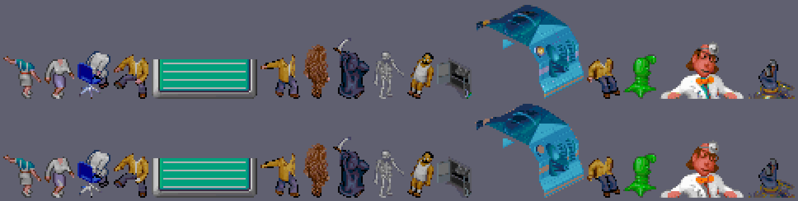

# Fase 2 — Inventario de los datos y presupuesto de cartucho

Fecha: 2026-10-09. Estado: **cerrada**. Datos: la versión de PC de Theme Hospital aportada por el usuario (`TH_DATA_DIR`, ver `docs/00_entorno.md`). Formatos según CorsixTH v0.70.1. Herramientas de conversión: las de libdragon `preview` de la fase 0.

Unidades: 1 MiB = 1.048.576 bytes. Los cartuchos de N64 se venden en «megas» que son MiB: el de 64 MB tiene 64 MiB (512 Mbit) y es el mayor que se fabricó.

## Conclusión

**El cartucho no es un problema.** Lo imprescindible cabe en 8 MiB; con locutor en dos idiomas y todos los vídeos, en 32 MiB; y con todo (seis idiomas y gráficos de alta resolución) ocupa 38 de 64 MiB.

| Escenario | MiB | Cartucho |
|---|---:|---|
| **A.** Inglés, sin locutor ni vídeos, gráficos a 320 × 240 | **6,39** | 8 MiB |
| **B.** A + locutor inglés + español completo (textos y voz) + los 24 vídeos | **22,79** | 32 MiB |
| **C.** B + los otros cuatro idiomas con voz + gráficos de alta resolución | **38,16** | 64 MiB |

- **El 94 % de los datos de PC son vídeo y sonido** (166,9 de 178,0 MiB). Los gráficos, mapas y textos del juego a 320 × 240, con los textos en inglés, ocupan **1,55 MiB** comprimidos (2,19 MiB con LZ4, el compresor más rápido).
- **Fuente de gráficos: `DATAM`**, la versión de baja resolución que el juego de PC ya traía para su modo de 320 × 200. Encaja con la N64: a 320 × 240 el hospital se ve con el mismo encuadre que en PC a 640 × 480, con la mitad de resolución. Sus sprites ocupan 1,30 MiB en CI8 (0,33 MiB comprimidos), frente a 4,72 MiB los de alta resolución. Es también lo que usó la PS1.
- **Sonido en VADPCM**, el formato por defecto de libdragon: 1,43 MiB de efectos más 2,9–4,9 MiB de locutor por idioma. ULC lo reduciría a una quinta parte y Opus a la mitad o menos, si la calidad lo aguanta.
- **Música en MIDI con SoundFont**: 1,81 MiB, frente a 11,4 MiB si se graba en Opus.
- **Vídeos opcionales**: los 24 que usa CorsixTH ocupan 8,0 MiB en H.264. La intro sola son 3,9 MiB.
- **Se queda fuera:** multijugador, ejecutables de DOS, los 11 vídeos que CorsixTH no usa y, si hace falta sitio, los idiomas sin pedir.

La limitación real sigue siendo la de la fase 1: RAM y CPU, no ROM. En [Implicaciones](#implicaciones-para-las-fases-3-y-4) está lo que estos datos ocuparían en RAM.

## Cómo se ha medido

- **Inventario.** `tools/datos/inventario.py` recorre `TH_DATA_DIR`, clasifica cada fichero y descomprime los RNC con el `rnc_decode` de CorsixTH.
- **Gráficos.** `graficos.py` decodifica las 99 hojas de sprites con el mismo algoritmo que CorsixTH y las escribe en formatos de textura de la N64. Las cifras son la suma de todos los sprites:
  - **CI8**: 1 byte por píxel con una paleta de 256 colores, filas alineadas a 8 bytes como pide la TMEM;
  - **CI4**: medio byte por píxel con una paleta propia de 16 colores (32 B), si el sprite usa como mucho 15 colores más el transparente;
  - **CI4 cuantizado**: todos los sprites reducidos a sus 15 colores más usados, como hizo la PS1;
  - versiones a 320 × 240 de lo que solo existe a 640 × 480.
- **Compresión.** `comprimir.py` pasa cada fichero por `mkasset` con los tres niveles de libdragon y ventana de 256 KiB:
  - `-c 1`: LZ4, el más rápido; la propia libdragon dice que cargar y descomprimir suele ser más rápido que cargar sin comprimir;
  - `-c 2`: aPLib;
  - `-c 3`: Shrinkler, el que más comprime y el más lento.
- **Audio, música y vídeo.** Se convierten con las herramientas de libdragon: `audioconv64` y `videoconv64`. Se mide el tamaño de lo que producen.
- **Código.** Para tener una referencia, `codigo.py` compila el Lua de CorsixTH a bytecode.

Cada guion escribe un JSON en `bench/resultados/fase2/`. Ningún dato del juego entra en el repositorio. Los ficheros intermedios (datos descomprimidos, WAV, MIDI, texturas) se quedan en `$TH64_WORK/fase2`.

## Inventario

467 ficheros, **178,05 MiB en disco** y 189,47 MiB una vez descomprimido el RNC:

| Grupo | Subgrupo | Ficheros | Disco (MiB) | Sin RNC (MiB) |
|---|---|---:|---:|---:|
| **Vídeo** | | **35** | **85,47** | **85,47** |
| | Intro y demo (`INTRO/`) | 3 | 53,67 | 53,67 |
| | Escenas (`ANIMS/`) | 32 | 31,81 | 31,81 |
| **Sonido** (`SOUND-x.DAT`, uno por idioma) | | **7** | **81,40** | **81,40** |
| **Ejecutables y controladores de DOS** | | **46** | **4,10** | **4,10** |
| **Interfaz de gestión (`QDATA`)** | | **205** | **2,86** | **8,14** |
| | Pantallas completas (bitmap + paleta) | 45 | 2,03 | 6,12 |
| | Hojas de interfaz y cursores | 63 | 0,45 | 1,03 |
| | Fuentes | 94 | 0,29 | 0,81 |
| | Tablas de remapeo de color (`GHOST`) | 3 | 0,09 | 0,19 |
| **Juego, baja resolución (`DATAM`)** | | **20** | **1,43** | **1,43** |
| | Sprites, bloques, panel, punteros | 16 | 0,95 | 0,95 |
| | Animaciones | 4 | 0,48 | 0,48 |
| **Juego, alta resolución (`DATA`)** | | **22** | **1,25** | **2,96** |
| | Sprites, bloques, panel, punteros, paleta | 17 | 1,00 | 2,47 |
| | Animaciones | 5 | 0,24 | 0,49 |
| **Mapas y niveles** | | **104** | **0,82** | **5,24** |
| | Configuración de la campaña (`.SAM`) | 39 | 0,40 | 0,40 |
| | Multijugador y extra (fuera de alcance) | 53 | 0,38 | 2,96 |
| | Mapas de la campaña (`LEVEL.L1`–`L12`) | 12 | 0,04 | 1,88 |
| **Textos** (`LANG-x.DAT` y dos `.LEX`) | | **8** | **0,57** | **0,57** |
| **Música** (XMI) | | **8** | **0,10** | **0,10** |
| **Fuentes de baja resolución (`QDATAM`)** | | **11** | **0,04** | **0,04** |
| Tabla de récords (`SAVE/HISCORE.DAT`) | | 1 | 0,00 | 0,00 |
| **Total** | | **467** | **178,05** | **189,47** |

El detalle por fichero está en `bench/resultados/fase2/inventario.json`.

## Formatos

Todo lo que sigue sale del código de carga de CorsixTH v0.70.1 (`CorsixTH/Src/` y `CorsixTH/Lua/`), que remite a su vez a la especificación comunitaria [theme-hospital-spec](https://github.com/CorsixTH/theme-hospital-spec). Los decodificadores de `tools/datos/` lo reimplementan y se han comprobado dibujando las hojas ([abajo](#gráficos)).

### Compresión RNC

241 de los 467 ficheros están comprimidos con RNC (Rob Northen), que se reconoce por la cabecera `RNC\x01`: los 22 de gráficos de `DATA/`, 188 de `QDATA/`, 29 mapas (los 12 de la campaña y 17 de los extra) y los dos `.LEX`. `DATAM/`, `QDATAM/`, los textos, el sonido y el vídeo no lo usan. CorsixTH los descomprime al leerlos (`lua_rnc.cpp`, herramienta `rnc_decode`). Para la N64 no tiene sentido conservar RNC: el conversor descomprime y vuelve a comprimir con `mkasset`, que es lo que sabe abrir `asset_load()`.

### Paletas

- `DATA/MPALETTE.DAT`: 256 colores × 3 bytes, cada componente de 6 bits (VGA, 0–63); CorsixTH los lleva a 8 bits (`th_gfx_sdl.cpp`). Es la paleta de todos los sprites del juego y del panel.
- `QDATA/*01V.PAL`: misma estructura, una por pantalla completa.
- El índice `0xFF` es siempre transparente en las hojas de sprites.
- `QDATA/GHOST*.DAT`: 256 tablas de 256 B que remapean índices de color. CorsixTH las usa para el «fantasma» de objetos y habitaciones al colocarlos (`Graphics:loadGhost`, `edit_room.lua`).

### Hojas de sprites (`.TAB` + `.DAT`)

- `.TAB`: 6 B por sprite: desplazamiento en el `.DAT` (u32 LE), ancho (u8) y alto (u8). Ningún sprite pasa de 255 × 255.
- `.DAT`: los píxeles de todos los sprites, codificados en «chunks» de longitud variable (`chunk_renderer::decode_chunks`, `th_gfx.cpp`). Hay dos variantes y la elige quien carga la hoja:
  - **simple** (sprites y bloques del juego, fuentes, punteros, `Money01V`): `0` rellena con transparente hasta el final de la línea; `1–0x7F` copia esos bytes literales; `0x80–0xFF` rellena `0x100 − b` píxeles transparentes;
  - **compleja** (panel, reloj, menú desplegable, hojas `*02V` de `QDATA`, `Req*`, `Award03V`): `0` fin de línea; `1–0x3F` copia literal; `0x80–0xBF` rellena `b − 0x80` transparentes; `0xFF n c` rellena `n` píxeles del color `c`; el resto rellena `b − 60 − (b & 0x80)/2` píxeles del color del byte siguiente.
  - Detalle que importa: un `0` al principio de una línea **no** rellena nada si la operación anterior acabó justo en el final de la línea anterior (`skip_eol`). Sin él, muchos sprites salen con líneas transparentes intercaladas.
- **Fuentes**: son hojas normales; el carácter `c` es el sprite `c − 31` (`bitmap_font`, `th_gfx_font.cpp`).

### Animaciones (`START`, `FRA`, `LIST`, `ELE`)

Un personaje u objeto en pantalla no es un sprite sino una **animación compuesta**: cada fotograma es una lista de elementos (sprites con desplazamiento y capa) que se dibujan juntos (`animation_manager::load_from_th_file`, `th_gfx.cpp`).

| Fichero | Registro | Contenido | `DATA` (V) | `DATAM` (M) |
|---|---:|---|---:|---:|
| `xSTART-1.ANI` | 4 B | primer fotograma de cada animación (u16) | 5.186 | 5.186 |
| `xFRA-1.ANI` | 10 B | índice en LIST (u32), ancho y alto (u8, no se usan), sonido (u8), flags (u8), siguiente fotograma (u16) | 11.643 | 11.643 |
| `xLIST-1.ANI` | 2 B | índices de elementos de cada fotograma, terminados por uno fuera de rango | 108.808 | 108.606 |
| `xELE-1.ANI` | 6 B | sprite (posición en el `.TAB` / 6, u16), x + 141 (u8), y + 186 (u8), capa (nibble alto) y flags (nibble bajo), id de capa (u8) | 26.674 | 24.983 |

- Los fotogramas forman una lista circular (`siguiente`); el campo sonido dispara un efecto de `SOUND-x.DAT`.
- Las **capas** (hasta 13, con `layer_id`) permiten variar ropa, pelo, color de piel… con los mismos fotogramas: la Lua elige qué id se dibuja en cada capa.
- `VSTA-0.ANI` (2.286 B) no lo usa CorsixTH.
- Las dos versiones tienen las mismas animaciones (`START` idéntico byte a byte) y los mismos fotogramas (mismo encadenamiento, sonido y flags). Cambian los sprites, que en `DATAM` son de mitad de resolución, y con ellos las listas y los elementos.

### Mapas `LEVEL.Lx`

163.948 B sin comprimir (`level_map::load_from_th_file`, `th_map.cpp`):

| Desplazamiento | Tamaño | Contenido |
|---:|---:|---|
| 0 | 34 B | cabecera; el byte 0 es el número de jugadores |
| 34 | 128 × 128 × 8 B | casillas: byte 1 = tipo de objeto que el mapa trae colocado y byte 0 su orientación; bytes 2–4 = bloque de suelo, pared norte y pared oeste (índices de `VBLK`/`MBLK` a través de una tabla fija); byte 5 = flags (bit 0 no transitable, bit 1 no edificable, bits 2–5 lados edificables); byte 7, bit 4 = fuera del hospital |
| 131.106 | 128 × 128 × 2 B | número de parcela de cada casilla (u16) |
| 163.876 | 4 × 2 B | casilla inicial de la cámara de cada jugador |
| 163.884 | 4 × 2 B | helipuerto de cada jugador |

RNC comprime estos mapas 47 veces (1,88 MiB de los 12 de la campaña quedan en 41 KiB en disco): son casi todo repeticiones.

### Configuración de niveles (`.SAM`)

Texto plano: líneas `#clave valor` (sueldos, enfermedades y su frecuencia, objetivos de victoria y derrota, inventos disponibles…) más los nombres del nivel en los seis idiomas (`&0`–`&5`). CorsixTH lee `EASY00`/`FULL00`/`HARD00.SAM` como base y encima el del nivel (`map.lua`).

### Textos (`LANG-x.DAT`)

u16 con el número de secciones, un u16 por sección con su número de cadenas y después todas las cadenas terminadas en `0`, en CP437 (CorsixTH detecta también CP936 y MIK, `th_string_list`). Seis idiomas: 0 inglés, 1 francés, 2 alemán, 3 italiano, 4 español, 5 sueco (`Inherit("original_strings", n)` en `languages/*.lua`). Los `.LEX` (dos listas de nombres) no los usa CorsixTH.

### Pantallas completas (`QDATA/*01V.DAT` + `.PAL`)

Bitmap de 640 × 480 a 8 bpp sin cabecera, con su paleta (`Graphics:loadRaw`). Son 21 pantallas (banco, personal, investigación, mapa de la ciudad, fax, títulos…), más `MAIN01M` (menú de la versión de baja resolución, 320 × 200). Los botones y textos que se dibujan encima están en la hoja `*02V` del mismo nombre.

### Sonido (`SOUND/DATA/SOUND-x.DAT`)

Un archivo por idioma (`sound_archive`, `th_sound.cpp`):
- los 4 últimos bytes dan la posición de una cabecera de 234 B; en ella, +50 es la posición de la tabla de entradas y +58 su longitud;
- cada entrada mide 32 B: nombre (18 B), posición (u32 en +18) y longitud (u32 en +26);
- cada entrada es un WAV PCM completo. La entrada 0 es el propio índice.

### Música (`SOUND/MIDI/*.XMI`)

XMIDI de Miles Sound System (120 ticks por segundo). CorsixTH la convierte a MIDI estándar al vuelo (`xmi2mid.cpp`) y la toca con FluidSynth y un SoundFont General MIDI.

### Vídeo (`INTRO/`, `ANIMS/`)

Smacker (`.SMK`; `INTRO.SM2` e `INTRO.SM4` son dos versiones de la intro, a 320 × 100 y 320 × 200, por los nombres para lectores de CD de 2× y 4×). CorsixTH los reproduce con FFmpeg (`th_movie.cpp`) y usa solo: `INTRO.SM4`, `INTRO/ATTRACT.SMK` (demo), `LOSE1–6`, `AREA01–14V` (paso de nivel en el mapa), `WINGAME` y `WINLEVEL` (`movie_player.lua`).

## Tamaño en la N64

Lo que pide el plan por grupo: tal cual, convertido al formato de la N64 y comprimido. Los gráficos de interfaz van reducidos a 320 × 240.

| Grupo | PC, en disco | PC, sin RNC | N64, sin comprimir | N64, comprimido (`-c 3` o códec) |
|---|---:|---:|---:|---:|
| Vídeo (los 24 que usa CorsixTH, en H.264 con audio) | 85,47 | 85,47 | — | 7,99 |
| Sonido, 6 idiomas (efectos comunes una sola vez; WAV → VADPCM) | 81,40 | 81,40 | 53,87 | 22,07 |
| Juego a baja resolución (`DATAM`): sprites, panel, animaciones (CI8) | 1,43 | 1,43 | 2,08 | 0,50 |
| Juego a alta resolución (`DATA`): ídem | 1,25 | 2,96 | 5,39 | 0,99 |
| Interfaz de gestión (`QDATA`) reducida a 320 × 240 (CI8) | 2,86 | 8,14 | 4,32 | 0,88 |
| Fuentes de baja resolución (`QDATAM`) | 0,04 | 0,04 | 0,04 | 0,01 |
| Mapas y `.SAM` de la campaña | 0,44 | 2,27 | 2,27 | 0,12 |
| Textos, 6 idiomas | 0,57 | 0,57 | 0,57 | 0,19 |
| Música (MIDI + SoundFont TimGM6mb → MID64 + SF64) | 0,10 | 0,10 | 5,88 | 1,81 |
| Multijugador y niveles extra | 0,38 | 2,96 | fuera | fuera |
| Ejecutables y controladores de DOS | 4,10 | 4,10 | fuera | fuera |
| **Total** | **178,05** | **189,47** | **74,44** (sin vídeo) | **34,58** |

Todo en MiB. «N64, sin comprimir» es el formato que leería la consola: texturas CI8, WAV PCM o MIDI con el SoundFont SF2. El total comprimido incluye a la vez los gráficos de alta y de baja resolución; en un juego real solo iría uno de los dos.

### Gráficos

Sprites de cada grupo de hojas, en MiB:

| Hojas | Sprites | Píxeles | RLE original | CI8 | CI8 `-c 1` | CI8 `-c 2` | CI8 `-c 3` | CI4 si cabe, si no CI8 | ídem `-c 3` |
|---|---:|---:|---:|---:|---:|---:|---:|---:|---:|
| Juego, baja resolución (`DATAM`: `MSPR-0`, `MBLK-0`) | 4.601 | 1,16 M | 0,80 | **1,30** | 0,46 | 0,35 | **0,33** | 1,17 (1.135 en CI4) | 0,33 |
| Juego, alta resolución (`DATA`: `VSPR-0`, `VBLK-0`) | 4.601 | 4,54 M | 2,38 | **4,72** | 1,18 | 0,85 | **0,81** | 4,27 (1.367 en CI4) | 0,84 |
| Panel, reloj, menús, punteros (`DATAM`) | 540 | 0,28 M | 0,11 | 0,29 | 0,04 | 0,03 | 0,02 | 0,28 (95 en CI4) | 0,02 |
| Panel, reloj, menús, punteros (`DATA`) | 156 | 0,18 M | 0,06 | 0,18 | 0,02 | 0,02 | 0,01 | 0,16 (52 en CI4) | 0,01 |
| Ventanas de gestión (`QDATA`, hojas `*02V`, `Req*`…) | 5.194 | 1,93 M | 0,74 | 1,94 | 0,32 | 0,24 | 0,21 | 1,88 (92 en CI4) | 0,21 |
| Fuentes (`QDATA`, 47 hojas) | 8.402 | 1,79 M | 0,76 | 2,21 | 0,29 | 0,23 | 0,21 | 1,96 (1.534 en CI4) | 0,21 |
| Fuentes (`QDATAM`, 5 hojas) | 802 | 0,03 M | 0,02 | 0,06 | 0,00 | 0,00 | 0,00 | 0,06 (0 en CI4) | 0,00 |

«Píxeles» cuenta los rectángulos de los sprites, transparentes incluidos. En `DATAM` es opaco el 54 % (0,63 Mpx).

**Alta frente a baja resolución.** Los sprites de `DATA` tienen 3,9 veces más píxeles que los de `DATAM` y ocupan 3,6 veces más en CI8. Comprimidos, la diferencia se queda en 2,5 veces (0,81 frente a 0,33 MiB). Las dos versiones tienen el mismo número de sprites y las mismas animaciones (5.186 animaciones, 11.643 fotogramas).

**CI4 frente a CI8.** En `DATAM`:
- solo 1.135 de los 4.601 sprites usan 15 colores o menos; con CI4 en esos, el total baja apenas un 10 % (1,30 → 1,17 MiB);
- cuantizando **todos** a 15 colores baja un 30 %, a 0,91 MiB. en la muestra de abajo apenas se distingue del original;
- no llega al 50 % porque cada sprite lleva su paleta de 32 B (0,14 MiB en total) y las filas se alinean a 16 píxeles, que en sprites estrechos es mucho relleno;
- comprimido, CI4 no gana nada: 0,31 MiB cuantizado frente a 0,33 en CI8. Al partir los píxeles en medios bytes, el compresor encuentra menos repeticiones;
- **CI4 compensa en RAM y en TMEM, no en el cartucho.** Si los sprites tienen que estar en RAM, la referencia es la PS1: los empaquetó en páginas de 4 bpp con paletas compartidas y ocupan 0,42 MiB.



*Sprites de `DATAM` con más de 15 colores, repartidos por toda la hoja, a 3 aumentos. Arriba el original en CI8; abajo la versión de 15 colores de `graficos.quantize15`.*

**Pantallas a 320 × 240.** Lo que solo existe a 640 × 480 se ha reducido a la mitad tomando un píxel de cada 2 × 2:
- **pantallas completas**: 21 bitmaps de 640 × 480 más `MAIN01M` (320 × 200), que ocupan 6,21 MiB; a 320 × 240 quedan en 1,60 MiB, y en 0,60 MiB con `-c 3`. A 640 × 480, comprimidas y con sus paletas, serían 1,67 MiB;
- **hojas de las ventanas**: de 1,94 a 0,52 MiB en CI8, y de 0,21 a 0,07 MiB comprimidas;
- **fuentes**: no se pueden reducir así sin volverse ilegibles. El presupuesto cuenta las de `QDATA` a tamaño original (0,21 MiB) como cota superior. `QDATAM` solo trae 5 fuentes de baja resolución frente a 47.

### Resto de datos, tal cual

Ficheros en bruto (sin RNC) comprimidos uno a uno con `mkasset`, en MiB:

| Ficheros | Nº | Disco | Sin RNC | `-c 1` | `-c 2` | `-c 3` |
|---|---:|---:|---:|---:|---:|---:|
| Mapas de la campaña (`LEVEL.L1`–`L12`) | 12 | 0,04 | 1,88 | 0,05 | 0,04 | 0,03 |
| Configuración de la campaña (`.SAM`) | 39 | 0,40 | 0,40 | 0,14 | 0,11 | 0,10 |
| Textos (`LANG-0` a `LANG-5`) | 6 | 0,57 | 0,57 | 0,25 | 0,21 | 0,19 |
| Animaciones de `DATAM` | 4 | 0,48 | 0,48 | 0,29 | 0,21 | 0,15 |
| Animaciones de `DATA` | 5 | 0,24 | 0,49 | 0,30 | 0,22 | 0,16 |
| Hojas de `DATAM` en formato original (RLE) | 16 | 0,95 | 0,95 | 0,57 | 0,42 | 0,40 |
| Hojas de `DATA` en formato original (RLE) y paleta | 17 | 1,00 | 2,47 | 1,23 | 0,90 | 0,88 |
| Pantallas completas de `QDATA` a 640 × 480 (con paletas, `TOWN` y `FACE01V`) | 45 | 2,03 | 6,12 | 2,24 | 1,85 | 1,67 |
| Hojas de interfaz de `QDATA` (RLE) | 63 | 0,45 | 1,03 | 0,54 | 0,43 | 0,39 |
| Fuentes de `QDATA` (RLE) | 94 | 0,29 | 0,81 | 0,36 | 0,27 | 0,24 |
| Fuentes y caras de `QDATAM` | 11 | 0,04 | 0,04 | 0,02 | 0,01 | 0,01 |

Un dato práctico: las hojas en su RLE original comprimen **peor** que ya decodificadas a CI8 (0,40 frente a 0,33 MiB en `DATAM`). Conviene convertirlas a textura en el ordenador y que la consola solo descomprima.

### Qué compresor

Sobre todo lo medido (23,50 MiB de texturas y 15,24 MiB de ficheros tal cual):

| Nivel | Texturas | Ficheros tal cual |
|---|---:|---:|
| `-c 1` LZ4 | 5,86 MiB (4,0×) | 5,98 MiB (2,6×) |
| `-c 2` aPLib | 4,48 MiB (5,2×) | 4,65 MiB (3,3×) |
| `-c 3` Shrinkler | 4,22 MiB (5,6×) | 4,22 MiB (3,6×) |

Shrinkler gana solo un 6–10 % a aPLib y, por diseño, es el más lento al descomprimir. Para los datos del escenario A, pasar de `-c 3` a LZ4 cuesta **0,64 MiB** (1,55 → 2,19 MiB). Con el cartucho sobrado, lo razonable es LZ4 por defecto, por velocidad de carga, y aPLib o Shrinkler solo donde sobre tiempo de carga y falte espacio. La velocidad real de cada uno en la consola se medirá en la fase 5.

## Sonido

Cada `SOUND-x.DAT` lleva **todos** los sonidos del juego para un idioma. Al comparar las muestras (formato y datos PCM, sin la cabecera RIFF) entre los seis archivos:

- **190 efectos son idénticos** en los seis idiomas: 16 bit, 22.050 Hz, mono (uno estéreo). Son 5,48 MiB en WAV y 2,1 minutos. Se guardarían una sola vez. (Se excluye `NULL.WAV`, dos muestras de silencio.)
- **185 sonidos cambian con el idioma** en el archivo inglés: los 146 del locutor (8 bit, 22.050 Hz) y 39 de 16 bit que también cambian (16 `ISPOT*`, 5 `VGM*` y otros como `FANFARE` o `MACHWARN`). Son 10,36 MiB y 7,5 minutos. En los otros idiomas son 197 y van a 11.025 Hz.

Conversión con `audioconv64` (`tools/datos/audio.py`), sumando los `.wav64` resultantes:

| Conjunto | Sonidos | WAV original | VADPCM | VADPCM a 11.025 Hz | ULC | Opus |
|---|---:|---:|---:|---:|---:|---:|
| Efectos comunes | 190 | 5,48 | **1,43** | 0,74 | 0,25 | 0,55 |
| Propios del inglés | 185 | 10,36 | **4,88** | 2,47 | 0,85 | 2,32 |
| Propios del francés | 197 | 7,09 | 2,94 | 2,59 | 0,52 | 0,83 |
| Propios del alemán | 197 | 7,47 | 3,06 | 2,71 | 0,55 | 0,89 |
| Propios del italiano | 197 | 7,53 | 3,15 | 2,80 | 0,55 | 0,90 |
| Propios del español | 197 | 8,28 | **3,46** | 3,11 | 0,62 | 1,04 |
| Propios del sueco | 197 | 7,66 | 3,13 | 2,78 | 0,59 | 1,01 |

Tamaños en MiB.

- **VADPCM** (ADPCM de 4 bits) es el formato por defecto de libdragon y el más sencillo de decodificar. **ULC** y **Opus** son códecs por transformada, también optimizados para el RSP. Según la ayuda de `audioconv64`, ULC es «simple y rápido» y Opus «más lento en ejecución, más pequeño en disco».
- Con sus parámetros por defecto, ULC (VBR, calidad 50) y Opus ocupan de 2 a 6 veces menos que VADPCM. Pero no dan la misma calidad, así que no se comparan solo por tamaño: hay que oírlos y medir su coste con muchos efectos a la vez en la fase 5.
- Con ULC, los seis idiomas completos cabrían en 3,92 MiB.
- El locutor inglés es el único a 22.050 Hz. Bajarlo a 11.025 Hz (la frecuencia de los demás idiomas) lo deja en 2,47 MiB; si se nota o no hay que oírlo en la fase 5.
- Seis idiomas con voz completa en VADPCM: 1,43 + 20,64 = **22,07 MiB**. Inglés y español: 1,43 + 4,88 + 3,46 = **9,78 MiB**.

## Música

8 piezas XMI, **21,9 minutos** en total. Convertidas a MIDI con el mismo código de CorsixTH (`tools/datos/xmi2mid.cpp` enlaza `CorsixTH/Src/xmi2mid.cpp`):

- Usan **27 programas** General MIDI y 22 notas de percusión; la polifonía máxima es de **15 notas** a la vez (`FORTUNE`; 7–15 según la pieza).
- XMI: 102 KiB; MIDI: 192 KiB; **MID64: 77 KiB** (0,07 MiB).
- Hace falta un SoundFont. Con TimGM6mb (General MIDI completo, 5,69 MiB, GPL-2, el paquete `timgm6mb-soundfont` de Ubuntu) el **SF64 ocupa 1,73 MiB**. `audioconv64` avisa de que ignora los LFO y las envolventes de modulación de la mayoría de instrumentos. Las muestras del SF64 se leen del cartucho al tocarlas (`sf64_load`), no se cargan en RAM.
- **Total MIDI + SoundFont: 1,81 MiB.**

La alternativa es grabar la música ya sintetizada (fluidsynth con el mismo SoundFont, 32 kHz):

| Formato | MiB |
|---|---:|
| WAV estéreo 32 kHz | 165,54 |
| VADPCM estéreo 32 kHz | 42,19 |
| VADPCM mono 22.050 Hz | 14,50 |
| Opus estéreo 32 kHz | 11,37 |
| **MID64 + SF64** | **1,81** |

MIDI con SoundFont ocupa entre 6 y 23 veces menos. Su coste es de CPU y RSP (sintetizar hasta 15 voces), que habrá que medir en la fase 5; la versión Opus cabe de sobra si el sintetizador resultara caro.

## Vídeo

Los 35 ficheros Smacker suman 85,47 MiB y 7,8 minutos, pero CorsixTH solo usa 24 (4,3 minutos). Los otros 11 (32,25 MiB) son la intro a 320 × 100 (`INTRO.SM2`), seis `320X240n.SMK` de duración parecida a las derrotas, otra versión de la demo sin sonido (`ANIMS/ATTRACT.SMK`), `MMENU1-0`, `MMENU2-0` y `LOPAPER`.

Recodificados con `videoconv64` a 320 px de ancho, calidad 70 (la del ejemplo `videoplayer` de libdragon) y 25 fps (MPEG-1 no admite las frecuencias de Smacker, 12–17,5 fps):

| Vídeo | Ficheros | Original | Duración | Smacker | MPEG-1 | H.264 | Audio WAV64 |
|---|---:|---|---:|---:|---:|---:|---:|
| Intro (`INTRO.SM4`) | 1 | 320 × 200, 18 fps | 88,9 s | 32,06 | 7,08 | 2,52 | 1,41 |
| Demo (`INTRO/ATTRACT.SMK`) | 1 | 640 × 300, 14 fps | 49,9 s | 6,01 | 3,86 | 0,51 | 0,78 |
| Paso de nivel (`AREA01–14V`) | 14 | 640 × 480, 14 fps, sin sonido | 58,9 s | 3,53 | 5,28 | 0,36 | 0,00 |
| Derrota (`LOSE1–6`) | 6 | 320 × 240, 12–15 fps | 50,9 s | 9,33 | 4,05 | 1,17 | 0,80 |
| Fin de la campaña (`WINGAME`) | 1 | 320 × 200, 14 fps | 9,6 s | 1,97 | 0,54 | 0,21 | 0,15 |
| Nivel superado (`WINLEVEL`) | 1 | 320 × 240, 14 fps | 2,2 s | 0,32 | 0,20 | 0,06 | 0,03 |
| **Total** | **24** | | **260,4 s** | **53,22** | **21,01** | **4,83** | **3,17** |

Tamaños en MiB.

- MPEG-1 va a tasa casi fija (701 kbit/s a calidad 70), así que no aprovecha que muchos vídeos sean casi estáticos: los 14 `AREA` ocupan más que el Smacker original.
- H.264 (perfil propio de libdragon, decodificado con ayuda del RSP) ocupa **4,4 veces menos** que MPEG-1. Su rendimiento en la consola está por medir.
- Todos los vídeos usados: **8,00 MiB** en H.264 más su audio, o 24,18 MiB en MPEG-1.

## Código

Para tener una referencia del código que iría en la ROM:

- **Bytecode Lua de CorsixTH** (`tools/datos/codigo.py`, `luac5.4 -s`): los 274 ficheros del motor (sin idiomas) son 2,49 MiB de fuente, **1,21 MiB de bytecode** y 0,54 MiB comprimidos con `mkasset -c 3`. Los 24 ficheros de idioma de CorsixTH suman 2,94 MiB de bytecode; inglés y `original_strings` (la parte que lee `LANG-x.DAT`), 0,11 MiB.
- **Ejecutable**: la ROM `n64/luabench` (libdragon + intérprete Lua 5.4 completo + benchmarks) ocupa 0,31 MiB. Un motor nativo con su intérprete o sin él estaría en el orden de 1 MiB; es una estimación, no una medida.
- Los recursos propios de CorsixTH (`CorsixTH/Bitmap`) son 6,45 MiB, pero casi todo son fondos del menú a 480, 720 y 1080 líneas que no hacen falta; el resto (`aux_ui`, la fuente de arranque, iconos) suma 146 KiB.

## Presupuesto de cartucho frente a 64 MiB

Cada línea usa la opción recomendada en este documento: gráficos de `DATAM` en CI8, interfaz de gestión a 320 × 240, `mkasset -c 3`, sonido en VADPCM, música en MIDI y vídeo en H.264. Con LZ4 en vez de Shrinkler, el escenario A crece 0,9 MiB (0,64 de datos y 0,26 de bytecode).

| Concepto | MiB |
|---|---:|
| Ejecutable: libdragon + motor (estimación, no medido) | 1,00 |
| Lógica del juego (referencia: bytecode Lua de CorsixTH + inglés) | 0,57 |
| Sprites y bloques del juego, `DATAM` en CI8 | 0,33 |
| Animaciones, `DATAM` | 0,15 |
| Panel, reloj, menús y punteros, `DATAM` en CI8 | 0,02 |
| Fuentes y caras de `QDATAM` | 0,01 |
| Ventanas de gestión (`QDATA`) a media escala, CI8 | 0,07 |
| Fuentes de `QDATA` a tamaño original (cota superior) | 0,21 |
| Pantallas completas a 320 × 240, CI8 | 0,60 |
| Mapas y `.SAM` de la campaña | 0,12 |
| Textos en inglés, paleta y `GHOST1` | 0,05 |
| Efectos de sonido comunes, VADPCM | 1,43 |
| Música: MID64 + SF64 (TimGM6mb) | 1,81 |
| **A. Mínimo: inglés sin locutor ni vídeos** | **6,39** |
| Locutor en inglés, VADPCM a 22 kHz | 4,88 |
| Español: textos, `spanish.lua` y locutor VADPCM | 3,53 |
| Vídeos que usa CorsixTH, H.264 + audio | 7,99 |
| **B. Recomendado: A + locutor inglés + español completo + vídeos** | **22,79** |
| Francés, alemán, italiano y sueco: textos y locutor | 12,50 |
| Gráficos de alta resolución (`DATA`): sprites CI8, animaciones y panel | 0,99 |
| Ventanas y pantallas de `QDATA` a 640 × 480 | 1,88 |
| **C. Todo: B + 6 idiomas + alta resolución** | **38,16** |

- **A cabe en 8 MiB, B en 32 MiB y C en 64 MiB** con 25,8 MiB libres. Ni siquiera haría falta usar el códec más compacto en cada caso: con vídeos en MPEG-1 (16,2 MiB más), C seguiría cabiendo en 64 MiB (54,3 MiB).
- **Lo que más pesa** es el locutor (2,9–4,9 MiB por idioma) y los vídeos (8 MiB). Gráficos, mapas y textos son menos de 2 MiB.
- Un flashcart como el SummerCart64 admite ROMs de hasta 64 MiB, así que cualquiera de los tres escenarios se puede probar en una N64 real.

## Qué se queda fuera

Propuesta para la fase 4, de más a menos claro:

1. **Ejecutables, controladores y utilidades de DOS** (4,10 MiB): no sirven en la N64.
2. **Multijugador y niveles extra** (`LEVEL.L13`, `L14`, `L2x`–`L4x`, `NET*`; 2,96 MiB sin comprimir): fuera de alcance del plan.
3. **Los 11 vídeos que CorsixTH no usa** (32,25 MiB): ver [Vídeo](#vídeo).
4. **Gráficos de alta resolución (`DATA`, `QDATA` a 640 × 480)**, si se confirma `DATAM` como fuente (siguiente apartado).
5. **Vídeos de CorsixTH** (8 MiB): opcionales. La intro (3,9 MiB) y la demo (1,3 MiB) son lo prescindible; los de derrota, nivel superado y paso de nivel (2,8 MiB) cuentan algo del juego y es mejor conservarlos si caben.
6. **Idiomas**: inglés como mínimo. Cada idioma con locutor suma 3,0–3,5 MiB; sin locutor, menos de 0,1 MiB (textos y su `.lua`). Español completo cuesta 3,53 MiB.
7. **Música en formato original**: se descarta el XMI tal cual. Va como **MID64 + SF64** (1,81 MiB). Si el sintetizador resultara caro en CPU, la alternativa es Opus (11,37 MiB), no XM: habría que rehacer las 8 piezas como módulos a mano.

## `DATAM` como fuente principal de gráficos

Propuesta: los sprites, bloques, animaciones, panel, reloj, menús y punteros salen de `DATAM` y `QDATAM`; solo lo que no existe ahí (las ventanas de gestión de `QDATA`) se convierte desde alta resolución.

- **Es el juego original, no una reducción nuestra.** Bullfrog la incluyó para el modo de 320 × 200 de la versión de DOS. Tiene los mismos 4.601 sprites y las mismas animaciones que la de alta resolución, con casillas de 32 × 16 en vez de 64 × 32.
- **Cuadra con la N64.** A 320 × 240, el hospital se ve con el mismo encuadre que en PC a 640 × 480. Sobran 40 líneas respecto al modo de 320 × 200 para el que se pensó.
- **Ocupa 3,6 veces menos** en CI8: 1,30 MiB frente a 4,72. Es lo que decide si los sprites pueden vivir en RAM. Comprimidos: 0,33 frente a 0,81 MiB.
- **Es lo que hizo la PS1**, con animaciones derivadas de las de `DATAM` y sprites de esa resolución.
- **Pendiente para la fase 4:**
  - las ventanas de gestión: reducirlas como aquí, rehacerlas como la PS1 o mostrarlas en modo 640 × 480;
  - qué fuentes usar en ellas: `QDATAM` solo trae 5 fuentes de baja resolución frente a las 47 de `QDATA`.

## Referencia: la versión de PlayStation

La versión de PS1 tuvo que meter este mismo juego en 2 MiB de RAM y 1 MiB de VRAM. Se ha analizado solo **qué datos lleva y cómo de grandes son** (sistema de ficheros del CD, cabeceras y tamaños), sin desensamblar el ejecutable. Las cifras salen de un lector ISO 9660 propio, fuera del repo.

| Contenido del CD | MiB | Qué es |
|---|---:|---|
| `SPEECH/*.XA` | 138,75 | locutor en audio XA, un fichero por idioma (21,0–26,8 MiB cada uno) |
| `MOV/` | 103,35 | vídeos (`INTRO.XXX` 32 MiB) y un `BLANK.PCM` de 26,5 MiB |
| `SCREENS/` | 4,71 | 20 fondos a pantalla completa en color directo (320 × 256 × 16 bit) y hojas de botones |
| `LEVEL1/` | 2,03 | los 12 mapas `LEVEL.Lx` sin comprimir más un `LEVEL.1`: seis idénticos a los de PC y los otros con 1–164 bytes distintos |
| `PSXDATA/` | 1,44 | sprites del juego, textos de 7 idiomas, efectos de sonido |
| ejecutable `SLUS_002.75` | 0,98 | |
| `LEVELS/` | 0,40 | los mismos 39 `.SAM` que en PC |
| `PSXFRONT/`, `PSXNEWS/` | 0,52 | menú principal y periódico |
| `PSXANI/` | 0,29 | animaciones |
| **Total** | **252,47** | de los que el juego sin voz ni vídeo son **10,37 MiB** |

Lo que enseña para la N64:

- **Sprites.** Todos los sprites del hospital caben en 7 páginas de textura a 4 bpp (6 de 512 × 256 y una de 512 × 180): **0,42 MiB** de píxeles más 560 paletas de 16 colores (17,5 KiB). Las siete tienen posiciones distintas en la VRAM, así que pueden estar cargadas a la vez. Por superficie (0,88 Mpx de páginas, frente a 1,16 Mpx de recuadros en `DATAM` y 4,54 en `DATA`) es la resolución de `DATAM`, recortada y empaquetada, con paletas de 16 colores compartidas entre sprites.
- **Animaciones.** `PSXANI` tiene los mismos cuatro ficheros que `DATAM` (`MSTART`, `MFRA`, `MLIST`, `MELE`): 0,29 MiB frente a 0,48 MiB en PC. `MSTART` y `MFRA` casi coinciden (20.912 y 122.988 B frente a 20.744 y 116.430); `MLIST` y `MELE` ocupan menos de la mitad, así que las listas de elementos se reorganizaron o se recortaron. Confirma que la PS1 parte de las animaciones de baja resolución de PC.
- **Efectos.** `SOUNDS.DAT` ocupa 0,45 MiB, frente a 5,48 MiB de efectos comunes en WAV en PC (no se ha analizado su formato ni cuántos efectos lleva). La voz va aparte, en streaming desde el CD.
- **Pantallas de gestión.** Sus fondos están rehechos a 320 × 256 en color directo; la interfaz de 640 × 480 no se llevó tal cual.

En una N64 los números son más holgados que en la PS1 en todo salvo en un punto: no hay CD para el locutor y los vídeos. A cambio, el cartucho es de acceso aleatorio y rápido, así que el audio y las texturas se pueden leer de él según se necesiten.

## Implicaciones para las fases 3 y 4

- **El cartucho no es el límite; la RAM sí.** Lo imprescindible cabe en 8 MiB, y con locutor y vídeos en 32 MiB. La decisión de la fase 4 se juega en RAM y CPU (fase 1), no en ROM.
- **Lo que tendría que estar en RAM** (estimado con los tamaños medidos, para la fase 4):
  - tablas de animación de `DATAM`: 0,48 MiB tal cual (la PS1 las dejó en 0,29 MiB);
  - mapa: 128 × 128 casillas × 8 B = 128 KiB más 32 KiB de parcelas, antes de las estructuras propias del motor;
  - textos del idioma activo: 93–109 KiB según el idioma (`LANG-x.DAT`);
  - sprites: de 0 (si se leen del cartucho bajo demanda, con una caché de texturas) a 1,30 MiB (todos los de `DATAM` en CI8); la PS1 los tenía todos residentes en 0,42 MiB;
  - audio y música: se leen del cartucho al reproducir (`wav64` y `sf64` lo hacen así); solo ocupan RAM sus búferes.
- **Gráficos a 320 × 240.** El juego y el panel tienen versión de baja resolución oficial (`DATAM`); las ventanas de gestión y sus fuentes no. Hay que decidir en la fase 4 entre reducirlas a la mitad en el conversor (lo medido aquí), rehacer su maquetación como hizo la PS1, o mostrar solo esas pantallas en modo 640 × 480 entrelazado.
- **CPU.** Las opciones que menos ocupan (ULC, Opus, H.264, CI4) piden más CPU o RSP. Con la CPU ya justa (fase 1), conviene empezar por las baratas (VADPCM, MIDI) y medir en la fase 5.

## Limitaciones

- **Calidad sin juzgar.** Los tamaños de CI4 cuantizado, sonido a 11 kHz o en ULC y Opus (con sus parámetros por defecto, que no dan la misma calidad), MIDI con TimGM6mb y vídeo a calidad 70 no dicen si se ve o se oye bien. Eso se decide mirando y escuchando en el prototipo; la imagen de arriba es solo una muestra.
- **Reducción a la mitad por vecino más próximo.** Mide bien el tamaño, pero no es como habría que reducir de verdad la interfaz (habría que filtrar o retocar a mano).
- **Un fichero, un asset.** `mkasset` comprime cada fichero por separado. Juntar ficheros pequeños (fuentes, hojas) en un solo asset comprimiría algo mejor; las cifras son, en ese sentido, un techo.
- **Código.** El tamaño del motor nativo es una estimación; el bytecode Lua y la ROM de `luabench` son las únicas referencias medidas.
- **SoundFont.** TimGM6mb es GPL-2 y es un banco General MIDI genérico: la música sonará distinta que con otro SoundFont. Otro SoundFont cambiaría el tamaño (de unos cientos de KiB si se recorta a los 27 instrumentos usados a varios MiB).

## Cómo reproducirlo

```bash
tools/setup.sh                  # entorno completo (incluye ffmpeg, fluidsynth y TimGM6mb)
source tools/env.sh
tools/datos/fase2.sh            # unos 30 min; deja los datos intermedios en $TH64_WORK/fase2
```

Cada paso es un guion de `tools/datos/` que se puede lanzar por separado:

| Guion | Qué hace | Resultado |
|---|---|---|
| `inventario.py` | clasifica y descomprime RNC | `inventario.json` |
| `graficos.py` | decodifica las hojas y genera CI8, CI4, CI4 cuantizado y versiones a 320 × 240 | `graficos.json` |
| `comprimir.py` | `mkasset -c 1/2/3` sobre todo lo anterior, en paralelo y con caché | `compresion.json` |
| `sonido.py` | extrae los WAV de `SOUND-x.DAT` y separa comunes y propios de cada idioma | `sonido.json` |
| `audio.py` | `audioconv64` a VADPCM y Opus | `audio.json` |
| `musica.py` | XMI → MIDI → MID64, SF64 y versiones renderizadas | `musica.json` |
| `video.py` | `videoconv64` a MPEG-1 y H.264 | `video.json` |
| `codigo.py` | bytecode Lua de CorsixTH | `codigo.json` |
| `muestra_ci4.py` | la imagen de comparación CI8 / CI4 | `docs/img/02_sprites_ci4.png` |

Los JSON están en `bench/resultados/fase2/`. Ningún dato del juego entra en el repositorio: los ficheros intermedios (WAV, MIDI, blobs) se quedan en `$TH64_WORK/fase2`.
