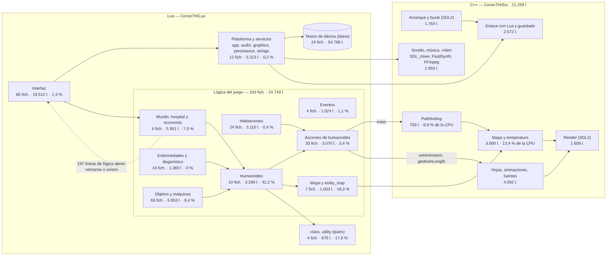
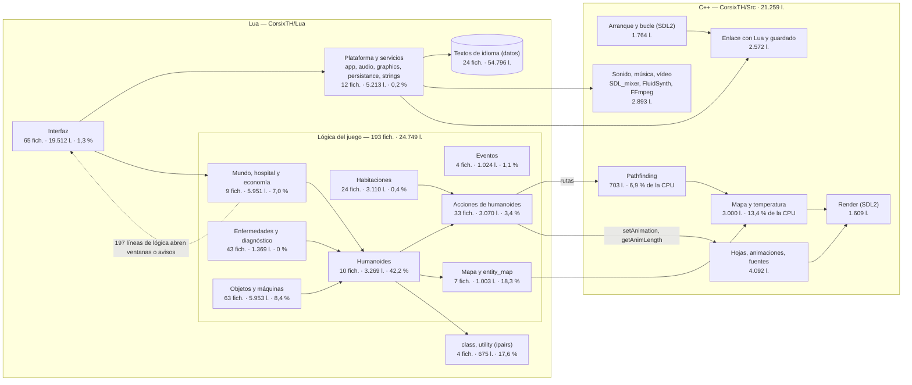

# Fase 3 — Arquitectura de CorsixTH y qué se puede reutilizar

Fecha: 2026-10-09. Estado: **cerrada**. Versión leída: CorsixTH v0.70.1 (`56bd5d0`). Las medidas de CPU usan la partida `lleno` de la fase 1 (304 pacientes, 57 empleados, 303 objetos).

## Conclusión

**CorsixTH es un juego escrito en Lua sobre un motor C++ pequeño.** La simulación entera (pacientes, personal, habitaciones, economía, eventos) está en Lua; el C++ pone el mapa, el pathfinding, las animaciones, el render y el sonido.

| | Ficheros | Líneas de código | Instrucciones de la simulación (callgrind) | Instrucciones de la VM de Lua (muestreo) |
|---|---:|---:|---:|---:|
| C++ (`CorsixTH/Src`, `libs/`) | 67 | 21.259 (2.778 son una tabla de caracteres chinos) | 21,9 % (temperatura 12,1 %, pathfinding 6,9 %) | — |
| Lua, en total | 298 | 104.945 | 76,5 % | 100 % |
| — lógica del juego | 193 | 24.749 | | 80,8 % |
| — plataforma y utilidades | 16 | 5.888 | | 17,8 % (casi todo `class.is` e `ipairs`) |
| — interfaz | 65 | 19.512 | | 1,3 % |
| — textos de idioma (datos) | 24 | 54.796 | | 0 % |

- **El coste está muy concentrado.** Una sola función, `Humanoid:findObjectsInSquare`, se lleva el **47 % de las instrucciones de la VM** de Lua en el hospital lleno, contando lo que llama (43 % en el mediano). Contando solo su propio código, ella, `EntityMap:getObjectsAtCoordinate`, `class.is` e `ipairs` suman el **57 %**. Los tres grupos donde está el coste (humanoides, mapa de entidades y utilidades) son 4.947 líneas: un 20 % de las 24.749 de lógica, que gasta el 78 % de las instrucciones.
- **La lógica está bastante separada de la interfaz.** De los 193 ficheros de lógica, 172 no tocan la UI y 101 no tocan ni UI, ni sonido, ni gráficos. Las 197 líneas de lógica que llaman a la UI están concentradas: 125 en `player_hospital.lua` y `world.lua`.
- **Pero la lógica depende de las animaciones para medir el tiempo:** 34 llamadas a `getAnimLength` en 21 ficheros (17 de acciones de humanoides) y 88 `setAnimation` fuera de la interfaz. Las tablas de animación hacen falta aunque no se dibuje nada (en `DATAM` y `DATA` duran lo mismo, fase 2).
- **El C++ tiene una frontera limpia con SDL**: todo el dibujo pasa por `render_target`, `sprite_sheet` y `palette` (`th_gfx_sdl.{h,cpp}`, 1.609 líneas y 196 referencias a SDL). El mapa (3.000 líneas), el pathfinding (703) y las animaciones (4.092) no llaman a SDL.
- **Lo que no cabe tal cual en la N64 es la memoria del C++:** cada casilla del mapa ocupa 84 B en la N64 y CorsixTH guarda dos copias del mapa (2,63 MiB), más 0,44 MiB de nodos de pathfinding. Y una partida guardada son 0,53–1,20 MiB (33–296 KiB comprimida), frente a 32–128 KiB de memoria de guardado en un cartucho.
- **Con los factores de CPU de la fase 1, ni un híbrido ni el C++ actual caben en la N64.** El hospital lleno necesitaría 34 veces la CPU a velocidad Normal. La fase 1 daba 39 porque aplicaba el factor de Lua a todo; aquí la parte de C++ lleva el suyo. Aunque las partes calientes de Lua pasaran a C a coste cero, seguirían haciendo falta 11. La difusión de temperatura del C++, sola, pide 2,6. Hace falta un motor con algoritmos pensados para la consola, que use la lógica de CorsixTH como especificación ([implicaciones](#implicaciones-para-la-fase-4)).
- **El port de Wii** (tueidj, 2013) no tocó la lógica. Cambió 26 ficheros (+522 −391 líneas) para que cupieran el sonido y los gráficos:
  - memoria virtual por hardware para el archivo de sonido (16 MiB virtuales con 512 KiB reales);
  - efectos decodificados al primer uso, con un máximo de 32;
  - una caché de variantes de sprites cuya implementación falta en el ZIP publicado;
  - lectores de datos independientes del endianness.

  Siguió componiendo el frame por CPU y manejó los mandos como un ratón ([detalles](#port-de-wii)).
- CorsixTH v0.70.1 usa **SDL2**, no SDL3 como suponía el plan.

## Diagrama de módulos



<details>
<summary>Fuente del diagrama (Mermaid)</summary>



</details>

En los grupos de Lua, el porcentaje es su parte de las instrucciones de la VM de Lua (coste propio) durante la simulación del hospital lleno. En el C++ es su parte de todas las instrucciones del proceso según callgrind. Las flechas son dependencias que aparecen en el código: símbolos de otro grupo y llamadas a las API de C++. La tabla completa de referencias entre grupos está en `bench/resultados/fase3/lua_modulos.json`. El diagrama se regenera con `npx @mermaid-js/mermaid-cli` a partir de la fuente.

## Núcleo C++

Medido con `tools/arquitectura/cpp.py`: líneas de código sin comentarios ni vacías, referencias a SDL (`SDL_*`, `Mix_*`), a la API de Lua y a FFmpeg.

| Subsistema | Ficheros | Líneas | SDL | API Lua | En la N64 | Por qué |
|---|---:|---:|---:|---:|---|---|
| Hojas de sprites, animaciones y fuentes (`th_gfx`, `th_gfx_font`, `th_lua_anims`, `th_lua_gfx`) | 7 | 4.092 | 3 | 661 | **Reutilizable con cambios** | El decodificador de chunks pasa al conversor del PC (ya está reimplementado en la fase 2). El gestor de animaciones (fotogramas, capas, marcadores, `getAnimLength`) hace falta en la consola tal cual; 1.585 líneas son enlace con Lua |
| Textos y codificaciones (`th_strings`, `th_lua_strings`, tablas CP437/CP936/MIK) | 6 | 3.576 | 0 | 304 | **Reutilizable** el lector de `LANG-x.DAT` y CP437 | La tabla CP936 (2.778 líneas, chino) y la MIK (ruso) sobran |
| Mapa y superposiciones (`th_map`, `th_map_overlays`, `th_lua_map`) | 5 | 3.000 | 0 | 357 | **Reutilizable con cambios** | Carga de `LEVEL.Lx`, banderas, parcelas, sombras y temperatura: C++ sin SDL. Pero cada casilla ocupa 84 B en la N64 (punteros de listas enlazadas, `std::list` de objetos, temperaturas dobles) y hay dos copias del mapa: 2,63 MiB. Hay que rehacer la disposición en memoria |
| Arranque y bucle principal (`main`, `bootstrap`, `sdl_core`, `sdl_wm`, `whereami`) | 12 | 1.764 | 68 | 212 | **Descartable** | Eventos, ventana y temporizador de SDL; en la N64 lo hace libdragon (`joypad`, `display`, `timer`) |
| Render (`th_gfx_sdl`) | 2 | 1.609 | 196 | 6 | **Reescribir con la misma interfaz** | `render_target`, `sprite_sheet`, `palette`, `raw_bitmap`, `cursor`: es la única frontera con el dibujo. Se reimplementa sobre `rdpq` con texturas CI8/CI4 |
| Enlace C++ ↔ Lua (`th_lua`, `th_lua_internal`, `th_lua_ui`, `th`) | 8 | 1.288 | 0 | 396 | **Depende del camino** | Imprescindible si se conserva Lua; sobra con un motor nativo |
| Guardado de partidas (`persist_lua`, `run_length_encoder`) | 4 | 1.284 | 0 | 425 | **Descartable** | Serializa el estado completo de Lua (0,53–1,20 MiB por partida). En la N64 hace falta un formato propio que quepa en 32–128 KiB |
| Música (`midi_player`, `th_lua_midi`, `xmi2mid`) | 5 | 1.021 | 4 | 54 | **`xmi2mid` en el PC; el resto descartable** | `xmi2mid` ya se usa en el conversor (fase 2); la reproducción pasa a MID64 + SF64 de libdragon |
| Vídeo (`th_movie`, `th_lua_movie`) | 3 | 962 | 59 | 36 | **Descartable** | FFmpeg; en la N64, el reproductor de vídeo de libdragon |
| Ficheros (`iso_fs`, `th_lua_iso`, `th_lua_lfs_ext`, `lua_rnc`, `libs/rnc`) | 8 | 944 | 0 | 95 | **RNC en el PC; el resto descartable** | Lectura de la ISO del juego y del sistema de ficheros; en la N64, DFS |
| Sonido (`th_sound`, `th_lua_sound`, `sdl_audio`) | 4 | 910 | 95 | 170 | **Lector en el PC; reproducción descartable** | El lector de `SOUND-x.DAT` pasa al conversor (fase 2); la mezcla pasa al mezclador de libdragon con WAV64 |
| Pathfinding (`th_pathfind`) | 2 | 703 | 0 | 29 | **Reutilizable con cambios** | A* sobre las banderas del mapa, sin SDL. Reserva un nodo de 28 B por casilla (0,44 MiB en la N64) más 64 KiB; habría que compactarlo. `visit_objects` llama a Lua |
| Números aleatorios (`random.c`, Mersenne Twister) | 1 | 106 | 0 | 34 | **Reutilizable** | C puro |
| **Total** | **67** | **21.259** | **425** | **2.779** | | |

Tamaños en memoria medidos compilando las cabeceras de CorsixTH (`tools/arquitectura/tamanos.sh`): con el compilador de la N64 (`mips64-elf-g++`, ABI o64 de libdragon) y en x86-64.

| Estructura | x86-64 | N64 | Cuántas | Total en la N64 |
|---|---:|---:|---:|---:|
| `map_tile` (casilla) | 120 B | 84 B | 2 × 128 × 128 | **2,63 MiB** |
| `path_node` (pathfinding) | 40 B | 28 B | 128 × 128 | 0,44 MiB |
| `level_map` | 160 B | 124 B | 1 | |
| `pathfinder` | 240 B | 144 B | 1 | |

En la casilla, solo los 8 bytes del formato original (`raw`) y las banderas son datos del juego. El resto son estructuras de C++: dos listas enlazadas, que son 24 B de punteros, una `std::list` de objetos y dos temperaturas. Un motor pensado para la N64 puede guardar una casilla en 8–16 B: 128–256 KiB por mapa.

## Lógica en Lua

Medido con `tools/arquitectura/lua_modulos.py`. Cuenta líneas de código, dependencias (símbolos globales de otro grupo) y líneas que tocan la interfaz (ventanas, `UI*`, `.ui`), el sonido (`.audio`, `playSound`, locutor) o los gráficos (`setAnimation`, `setLayer`, `setMood`, `.gfx`, cursores). Los porcentajes son el coste propio en instrucciones de la VM durante la simulación del hospital lleno.

| Grupo | Ficheros | Líneas | Líneas que tocan UI | Sonido | Gráficos | Ficheros sin UI | Instrucciones VM |
|---|---:|---:|---:|---:|---:|---:|---:|
| Entidades: humanoides (`entities/humanoid*`) | 10 | 3.269 | 16 | 3 | 51 | 6 | **42,2 %** |
| Mapa y entidades en el mapa (`map`, `entity_map`, `walls/`) | 7 | 1.003 | 0 | 0 | 1 | 7 | **18,3 %** |
| Utilidades del lenguaje (`class`, `utility`, `strict`, `date`) | 4 | 675 | 0 | 0 | 10 | 4 | **17,6 %** |
| Entidades: objetos y máquinas (`entity`, `entities/object`, `objects/`) | 63 | 5.953 | 15 | 7 | 34 | 58 | 8,4 % |
| Mundo, hospital y economía (`world`, `hospital*`, `queue`, `calls_dispatcher`, `research_department`…) | 9 | 5.951 | 132 | 15 | 7 | 4 | 7,0 % |
| Acciones de humanoides (`humanoid_actions/`) | 33 | 3.070 | 9 | 3 | 127 | 32 | 3,4 % |
| Interfaz (`ui`, `game_ui`, `window`, `dialogs/`) | 65 | 19.512 | 2.280 | 163 | 544 | 1 | 1,3 % |
| Eventos (`epidemic`, `earthquake`, `cheats`, `announcer`) | 4 | 1.024 | 17 | 14 | 3 | 1 | 1,1 % |
| Habitaciones (`room`, `rooms/`) | 24 | 3.110 | 8 | 0 | 24 | 21 | 0,4 % |
| Plataforma y servicios (`app`, `audio`, `graphics`, `persistance`, `strings`…) | 12 | 5.213 | 75 | 72 | 43 | 7 | 0,2 % |
| Enfermedades y diagnóstico (`diseases/`, `diagnosis/`) | 43 | 1.369 | 0 | 0 | 227 | 43 | 0 % |
| Textos de idioma (`languages/`, son datos) | 24 | 54.796 | — | — | — | — | 0 % |

- **Lógica de juego pura** (los ocho grupos de lógica): 193 ficheros y 24.749 líneas. 172 ficheros (13.207 líneas) no nombran la UI; 101 (6.853 líneas) no tocan ni UI, ni sonido, ni gráficos.
- **Dónde está el acoplamiento con la UI:** `hospitals/player_hospital.lua` (79 líneas: mensajes, faxes, consejero), `world.lua` (46: velocidad, teclas, zoom, ventanas), `epidemic.lua` (11), `pickup.lua` (9) y `staff.lua` (7). Son avisos y ventanas que abre la simulación; se pueden sustituir por eventos hacia la UI.
- **Gráficos dentro de la lógica:** son decisiones de aspecto, no de dibujo. Las enfermedades eligen capas (`setLayer`, 227 líneas: cabeza hinchada, ropa…), los humanoides muestran iconos de humor (`setMood`) y las acciones eligen animación y velocidad por casilla. Todo eso se puede traducir a llamadas a un gestor de animaciones nativo.
- **Dependencias más fuertes entre grupos** (referencias a símbolos de otro grupo): Interfaz → Plataforma 1.032 (casi todo `_S`, los textos), Interfaz → Utilidades 238, Habitaciones → Acciones 174, Mundo → Plataforma 168 (`_S`, `_A`), Enfermedades → Plataforma 145 (`_S`), Objetos → Humanoides 95. La lógica apenas nombra clases de la interfaz: 12 referencias desde humanoides y 15 desde objetos (abrir la ficha de un paciente o de una máquina).
- **Clases:** 195 declaraciones `class`, 160 con clase base. La jerarquía de entidades es `Entity` → `Humanoid` → `Patient`, `Staff` (→ `Doctor`, `Nurse`, `Handyman`, `Receptionist`), `Vip`, `Inspector` y `GrimReaper`; y `Entity` → `Object` → `Machine`.

## Dónde se va el tiempo de la simulación

Dos mediciones complementarias sobre la partida `lleno`, sin dibujar frames durante la medición (`bench/scenarios/perfil.lua --th64-frames=0`):

### Dentro de Lua (muestreo)

Un hook de conteo cada 1.000 instrucciones de la VM, 300 horas de juego, 79.986 muestras (unas 267.000 instrucciones de la VM por hora de juego; 72.000 en el hospital mediano). Cuenta instrucciones de Lua, no tiempo de funciones C.

| Función (inclusivo: ella y lo que llama) | Lleno | Mediano |
|---|---:|---:|
| `World:onTick` | 98,2 % | 93,6 % |
| `Staff:tick` (todo el personal) | 59,1 % | 65,3 % |
| `Humanoid:findObjectsInSquare` | **47,2 %** | **43,3 %** |
| `Doctor:tick` | 36,5 % | 37,8 % |
| `Entity:tick` (avance de animaciones y temporizadores) | 19,2 % | 17,5 % |
| `World:onEndDay` | 16,7 % | 11,7 % |
| `EntityMap:getObjectsAtCoordinate` | 15,1 % | 13,3 % |
| `Patient:tick` | 14,4 % | 7,9 % |
| `Patient:tickDay` | 13,7 % | 8,0 % |
| `walk` (acción de andar) | 9,4 % | 8,0 % |
| `class.is` | 8,6 % | 11,8 % |
| `ipairs` (versión en Lua de `utility.lua`) | 8,2 % | 7,5 % |

- **`findObjectsInSquare`** recorre un cuadrado de 5 × 5 casillas, consulta el número de habitación de cada una en C++ y crea tablas nuevas con los objetos encontrados. `Staff:tick` la llama **en cada hora de juego** para que cada empleado busque basura, y además dos veces al día para plantas y objetos agradables; los pacientes, tres veces al día. En el hospital lleno salen unas 78 búsquedas por hora de juego y unas 1.600 instrucciones de la VM cada una, para un efecto pequeño en la felicidad.
- **`ipairs` y `class.is`** son sobrecoste del lenguaje. `utility.lua` sustituye `ipairs` por una versión en Lua para admitir `__ipairs`, que Lua 5.4 ya no tiene. `class.is` es la comprobación de tipos de su sistema de clases. Juntos son el 17 % de las instrucciones, y en C no existirían.

### C++ y VM de Lua (callgrind)

150 horas de juego bajo valgrind/callgrind (`tools/bench_run.sh --callgrind`), con la instrumentación activa solo durante la medición y sin dibujar. Cuenta instrucciones x86 de todo el proceso: **24,6 millones por hora de juego**.

| Dónde | Instrucciones |
|---|---:|
| VM de Lua (`liblua5.4`) | **76,5 %** |
| C++ de CorsixTH | **21,9 %** |
| — temperatura (`level_map::update_temperatures` y `thermal_neighbour`) | 12,1 % |
| — pathfinding (`th_pathfind`) | 6,9 % |
| — resto del mapa, enlace con Lua, animaciones | 2,9 % |
| libc, libstdc++, SDL y otros | 1,6 % |

- **La temperatura es el 12 % de la simulación.** `update_temperatures` recorre las 16.384 casillas del mapa en cada hora de juego, con cuatro vecinas por casilla y aritmética en `double`, para difundir el calor de los radiadores. En PC no se nota; en la N64 sí (ver [implicaciones](#implicaciones-para-la-fase-4)).
- **El pathfinding es poco** (6,9 %): las rutas se calculan al empezar a andar, no en cada paso.
- **Las animaciones apenas cuestan en la simulación** (0,1 %): avanzar fotogramas es barato; lo caro de ellas es dibujarlas, que aquí no se mide.

Los porcentajes de Lua del apartado anterior se reparten dentro de ese 76,5 %.

## Port de Wii

**Fuente:** el ZIP del código fuente (`CorsixTH-wii-src.zip`, v1.02 de tueidj, 10,3 MiB y 5.012 entradas), recuperado por Eduardo de la copia de la Wayback Machine que enlaza [WiiBrew](https://wiibrew.org/wiki/CorsixTH). Se ha leído fuera del repositorio y no se ha compilado ni ejecutado nada de él.

**Base.** Se ha comparado con el historial oficial de CorsixTH, normalizando los finales de línea (el ZIP usa CRLF). La base es el commit `47d7b005` del 27-12-2012, una 0.20 en desarrollo: coinciden 587 de los 641 ficheros del árbol de CorsixTH. Los cambios del port:
- **26 ficheros** de CorsixTH modificados: **522 líneas añadidas y 391 quitadas**, sin contar espacios;
- dos ficheros nuevos, `wii_vm.c` (519 líneas) y `wii_vm.h`;
- `main.cpp` renombrado a `th_main.cpp`;
- además trae SDL 1.2 para Wii (el port de Tantric) y Lua 5.1.3 con 7 ficheros cambiados.

Dos avisos antes de los detalles:
- **El ZIP está incompleto.** `th_gfx_sdl.cpp` incluye `th_gfx_sdl_cache.h`, con las clases `THBitmapCache`, `THCachedBitmap`, `THScaledCachedBitmap` y `THSpriteCachedBitmap`, y no está en el archivo. Tampoco está el stub en ensamblador `dsi_handler` que usa la memoria virtual. Tal cual no compila, y **la implementación de la caché LRU de gráficos no se puede leer**: solo se ve cómo se usa.
- **`wii_vm.c` y `wii_vm.h` no son reutilizables.** Llevan la cabecera «Copyright 2013 tueidj All Rights Reserved. This code may not be used in any project without explicit permission from the author», distinta de la MIT que indica WiiBrew para el port. Aquí solo se describe la técnica.

### Memoria virtual para el sonido (`wii_vm.c`)

- **Paginación por hardware con la MMU del Broadway.** Reserva una región virtual de hasta 256 MiB justo por debajo de `0x80000000`, con su propia tabla de páginas hash (64 KiB) y páginas de 4 KiB. El respaldo es un fichero de paginación en la NAND (`/tmp/pagefile.sys`), que se rellena entero al arrancar.
- **Fallo de página.** Lo atiende la excepción DSI. La víctima se elige con el **algoritmo del reloj (segunda oportunidad)**, usando los bits de referencia (R) y de cambio (C) del hardware. Si la página está sucia se escribe en la NAND, agrupando hasta 4 páginas consecutivas; la nueva se lee si ya existía y, si no, se pone a cero.
- **Único uso: el archivo de sonido.** `THSoundArchive` pide 16 MiB virtuales con 512 KiB de memoria real (`VM_Init(16<<20, 512<<10)`) y copia ahí el `SOUND-x.DAT` entero, que ocupa 13–16 MiB según el idioma (fase 2). De ahí la cifra de WiiBrew: «de ~16 MB a ~512 KB».

### Efectos de sonido bajo demanda (`th_sound.cpp`)

- CorsixTH decodificaba **todos** los efectos a `Mix_Chunk` al cargar el archivo. El port los decodifica la primera vez que suenan.
- **No es una LRU con presupuesto, sino un límite natural.** Cada efecto lleva la cuenta de los canales que lo usan. Los 32 canales se asignan en rueda, prefiriendo uno libre que ya tuviera ese mismo efecto. Cuando un canal pasa a otro efecto y la cuenta del anterior llega a cero, se libera. Por tanto, nunca hay más de 32 efectos decodificados a la vez.

### Caché de gráficos (`th_gfx_sdl.cpp`: 58 líneas añadidas y 282 quitadas)

- **Qué se cachea.** Cada superficie SDL de sprites y bitmaps pasa a ser un `THCachedBitmap`, y el destino de render crea una `THBitmapCache(1500)`. Las variantes de cada sprite (volteado, transparencias al 50 y 75 %, paleta alternativa: hasta 32 por sprite) ya no se construyen como superficies SDL. Ahora son `THSpriteCachedBitmap` que se generan al pedirlas.
- **Qué desaparece.** El escalado de bitmaps con AGG (filtro bilineal, unas 120 líneas) se sustituye por `THScaledCachedBitmap`.
- **Qué no cambia:** cada hoja se sigue decodificando entera a 8 bpp en RAM al cargarla. Lo que se cachea son las versiones derivadas, listas para dibujar.
- **Qué no se puede comprobar:** si el 1500 son entradas o KiB, y la política de expulsión. Esa clase no está en el ZIP.

### Render, audio y entrada

- **Render por software.** CorsixTH sigue componiendo cada frame en una superficie de 8 bpp con blits de la CPU (SDL). El SDL de la Wii sube el frame entero como textura CI8 (`GX_TF_CI8`, con la paleta en dos TLUT) y lo dibuja como un solo rectángulo con la GPU. Resolución de 640 × 480, o 848 × 480 en televisores 16:9, siempre a pantalla completa y con ajuste de overscan.
- **Audio.** SDL_mixer mezcla todo en la CPU (TiMidity para el MIDI), y SDL saca el resultado por una sola voz del DSP con libaesnd.
- **Mandos tratados como ratón** (`sdl_core.cpp`, 153 líneas nuevas):
  - el stick izquierdo mueve el puntero, desplazándolo el valor del eje dividido por 3.072 en cada vuelta del bucle;
  - los botones 0 y 1 son los clics izquierdo y derecho;
  - 2 y 9 hacen de Intro, 3 y 10 de Escape, y 5 de P (pausa);
  - la cruceta y el segundo stick hacen de flechas (scroll del mapa);
  - el scroll por los bordes de la pantalla se desactiva.

  La interfaz de CorsixTH no se toca: se sigue manejando como con ratón.

### Endianness

- **Cómo lo resuelve.** Una plantilla nueva en `th.h`, `LittleEndian<T>(puntero, índice)`, lee byte a byte sin depender del procesador. Se aplica en estos sitios:
  - la tabla de sprites (`.TAB`: posición u32);
  - las animaciones: `START` (u16), `FRA` (`list_index` u32 y `next` u16), `LIST` (u16) y `ELE` (`table_position` u16);
  - la cabecera y la tabla de `SOUND-x.DAT`;
  - las parcelas del mapa (u16);
  - los contadores de `LANG-x.DAT` (u16);
  - la cabecera MIDI que genera `xmi2mid`, que ahora solo invierte bytes si la máquina es little-endian.
- **Error aparente.** `THMap::_readTileIndex`, que lee la casilla inicial de la cámara y la del helipuerto, usa `LittleEndian<unsigned int>(pData, 1)`. Eso lee 4 bytes a partir de `pData + 4`, y no el byte `pData[1]` que leía el original, así que esas dos posiciones saldrían mal en la Wii. CorsixTH actual resolvió el endianness de otra forma: con `bytes_to_uint16_le` y `bytes_to_uint32_le` en todos los lectores.

### Lua y lógica del juego

- **Lua 5.1.3 modificado.** El asignador obliga a llenar los 24 MiB de MEM1 antes de pasar a MEM2, reservando y liberando un bloque grande. `io.read(n)` lee el fichero de una vez en lugar de por bloques, y se quita `os.execute`. Los números siguen siendo `double`, y no hay límite de heap ni cambios en el recolector.
- **Ningún cambio en la simulación.** Lo que cambia en Lua es configuración (640 × 480 a pantalla completa, sin scroll por bordes), una línea en las ventanas a pantalla completa (`on_top`) y añadir `joystick` a `SDL.init`. No cambia ni un `.level` ni un fichero de lógica.

### Lo que enseña para la N64

1. **El mismo problema de memoria, a otra escala.** Con 88 MiB, lo que no cabía era el sonido (el archivo de 16 MiB y los efectos decodificados) y las superficies de gráficos. La lógica no hubo que tocarla. En la N64 el archivo de sonido no necesita memoria virtual: se convierte a WAV64 y se queda en el cartucho, que la consola lee por DMA (fase 2).
2. **Cargar al primer uso con un límite natural** (los canales del mezclador) vale tal cual para los efectos en la N64. `wav64` ya lee del cartucho mientras suena.
3. **Las variantes de sprite no hacen falta en la N64.** El RDP voltea y aplica transparencia al dibujar, y la paleta alternativa es otra TLUT, así que no hay que guardar copias.
4. **Componer el frame por CPU, como hace el port, no es viable en la VR4300.** Ya a 320 × 240 son 76.800 píxeles por frame. El RDP tiene que dibujar cada sprite como textura, que es lo previsto en la fase 3.
5. **El orden de bytes conviene resolverlo en el conversor**, no en la consola. Y con lectores explícitos y probados: el error de `_readTileIndex` muestra lo fácil que es equivocarse al convertir a mano.
6. **Controles.** El esquema «stick como puntero, botones como clics, cruceta para el scroll» bastó para jugar en la Wii sin tocar la interfaz. Es un buen punto de partida para la fase 4, junto con el ratón de N64, que libdragon admite (`JOYPAD_STYLE_MOUSE`).

## Tabla de reutilización

Resumen de las dos tablas anteriores, como entrada para la fase 4. «Herramienta» significa que el código se usa en el PC para convertir los datos (fase 2) y no va en la ROM.

| Pieza | Origen | Tamaño | Decisión | Motivo medido |
|---|---|---:|---|---|
| Decodificador de hojas (chunks), RNC, lector de `SOUND-x.DAT`, `xmi2mid`, lector de `LANG-x.DAT` | C++ | ~1.200 l. | **Herramienta** | Ya reimplementados o enlazados en `tools/datos/` |
| Gestor de animaciones (fotogramas, capas, marcadores, duración) | C++ `th_gfx` | ~1.400 l. | **Reutilizar con cambios** | La lógica lo necesita para medir el tiempo (34 `getAnimLength`); sin SDL |
| Render: `render_target`, `sprite_sheet`, `palette` | C++ `th_gfx_sdl` | 1.609 l. | **Reescribir con la misma interfaz** | 196 referencias a SDL; es la única frontera con el dibujo |
| Mapa: carga, banderas, parcelas, sombras | C++ `th_map` | ~2.000 l. | **Reutilizar el algoritmo; rehacer la casilla** | 84 B × 2 copias por casilla = 2,63 MiB en la N64 |
| Temperatura | C++ `th_map` | ~100 l. | **Reutilizar con otra frecuencia** | Recorre las 16.384 casillas en cada hora de juego: el 12,1 % de la simulación |
| Pathfinding | C++ `th_pathfind` | 703 l. | **Reutilizar con nodos compactos** | A* sin SDL; 0,44 MiB de nodos en la N64 |
| Números aleatorios | C `random.c` | 106 l. | **Reutilizar tal cual** | Mersenne Twister en C puro |
| Enlace con Lua | C++ `th_lua*` | 1.288 l. | **Según el camino** | Solo si se conserva Lua |
| Guardado | C++ `persist_lua` | 1.284 l. | **Descartar; formato propio** | 0,53–1,20 MiB por partida frente a 32–128 KiB de guardado |
| Arranque, eventos, sonido, música, vídeo, ficheros | C++ + SDL2, SDL_mixer, FluidSynth, FFmpeg | 5.601 l. | **Descartar** | Lo cubre libdragon (`joypad`, `mixer`, `wav64`, `mid64`, vídeo, DFS) |
| Humanoides, `entity_map`, `class`/`ipairs` | Lua | 4.947 l. | **Reescribir en C** | 78 % de las instrucciones de la VM; `findObjectsInSquare` sola, 47 % |
| Mundo, hospital, objetos, acciones, habitaciones, eventos | Lua | 19.108 l. | **Especificación para C, o Lua en un híbrido** | 20 % de las instrucciones de la VM; casi sin UI (172 de 193 ficheros) |
| Enfermedades y diagnóstico | Lua | 1.369 l. | **Pasar a tablas de datos** | 0 % de CPU; 43 ficheros de definiciones |
| Interfaz | Lua | 19.512 l. | **Rehacer** para mando y 320 × 240 | 2.280 líneas de UI, 544 de gráficos; sirve como referencia de pantallas y flujos |
| Textos de idioma | Lua | 54.796 l. | **Convertir a tablas de cadenas** | Datos; solo los idiomas incluidos (fase 2) |

## Implicaciones para la fase 4

Estimación del coste en la N64 con los factores medidos en la fase 1. Una hora de juego del hospital lleno cuesta 5,07 ms en la máquina de medición. Lua corre unas 400 veces más despacio en la VR4300 y el C unas 227 veces. Aquí ese tiempo se reparte según la medida de callgrind:

| Parte de la hora simulada | En PC | En la N64 (estimado) | Veces la CPU de la N64 a velocidad Normal (18,5 h/s) |
|---|---:|---:|---:|
| VM de Lua (76,5 %) | 3,88 ms | 1.551 ms | 28,7 |
| C++ y bibliotecas (23,5 %) | 1,19 ms | 271 ms | 5,0 |
| — de ello, temperatura | 0,61 ms | 140 ms | 2,6 |
| — de ello, pathfinding | 0,35 ms | 79 ms | 1,5 |
| **Total** | **5,07 ms** | **1.822 ms** | **33,7** |
| Si las partes calientes de Lua (78 %) costaran **cero** | | 610 ms | **11,3** |

- **Camino híbrido (CorsixTH en Lua con las partes calientes en C): no basta.** Aunque los humanoides, `entity_map`, `class.is` e `ipairs` pasaran a C sin coste alguno, el resto de la simulación en Lua más el C++ actual seguirían necesitando unas 11 veces la CPU de la N64 en el hospital lleno. Además, la memoria de Lua no cambiaría: 12,7–17,7 MiB de heap vivo (fase 1).
- **Ni siquiera el C++ actual cabe en el presupuesto.** La temperatura sola, con el algoritmo de CorsixTH, necesitaría 2,6 veces la CPU a velocidad Normal, y el pathfinding 1,5 veces. Un motor para la N64 tiene que **cambiar algoritmos**, no solo de lenguaje:
  - temperatura por habitación o repartida entre varias horas;
  - búsquedas de objetos cercanos con contadores mantenidos al añadir y quitar objetos, en vez de recorrer 25 casillas;
  - actualización de entidades escalonada entre ticks.

  El juego original corría en PC con DOS y en una PlayStation a 33,9 MHz: la misma simulación se puede hacer mucho más barata. CorsixTH, pensado para PC actuales, no lo necesita.
- **La lógica de CorsixTH sirve como especificación.** Son 24.749 líneas, en su mayoría separables de la UI. Lo que vale de ellas son las reglas, los tiempos y las fórmulas, no la implementación. Las tablas de animación hacen falta en cualquier caso, porque fijan cuánto dura cada acción.
- **Memoria.** Las estructuras C++ actuales ya ocuparían 3,1 MiB en la N64: 2,63 MiB de mapa y 0,44 MiB de pathfinding. Para el presupuesto de RAM de la fase 4 hay que partir de un mapa de 8–16 B por casilla, nodos de pathfinding compactos y un formato de guardado propio que quepa en 32–128 KiB.
- **El render es la pieza mejor aislada.** Basta con reimplementar `render_target`, `sprite_sheet` y `palette` sobre `rdpq`, usando las texturas CI8 de `DATAM` que se midieron en la fase 2.

Estas cifras son estimaciones (instrucciones de x86 convertidas con factores de un benchmark); las medirá de verdad el prototipo de la fase 5.

## Limitaciones

- **Instrucciones no son tiempo.** El muestreo de Lua cuenta instrucciones de la VM, y callgrind instrucciones de la CPU x86. En la VR4300, con su caché pequeña y una memoria lenta (fase 1), el reparto real puede cambiar, sobre todo en lo que recorre mucha memoria (temperatura, `entity_map`).
- **El hook de muestreo** se ejecuta dentro de la VM y su propio coste no se cuenta, pero cambia algo el comportamiento de la caché. Sirve para el reparto, no para tiempos absolutos.
- **Clasificación por expresiones regulares.** Las líneas «que tocan la UI, el sonido o los gráficos» se detectan por patrones (`tools/arquitectura/lua_modulos.py`). Se han revisado a mano en varios ficheros, pero es una medida aproximada.
- **Las cifras de C++ por subsistema** dependen de cómo se asignan los ficheros a cada subsistema, que se ha hecho a mano leyendo cada uno.
- **Port de Wii incompleto:** el ZIP publicado no trae la implementación de la caché de gráficos (`th_gfx_sdl_cache.h`) ni el stub `dsi_handler`; lo dicho sobre esa caché se deduce de cómo se usa.

## Cómo reproducirlo

```bash
source tools/env.sh
# Núcleo C++: líneas, SDL, API de Lua y tamaños de las estructuras (x86-64 y N64)
python3 -I tools/arquitectura/cpp.py "$CORSIXTH_DIR" bench/resultados/fase3/cpp.json
tools/arquitectura/tamanos.sh bench/resultados/fase3/tamanos.json
# Perfil de la simulación en Lua (muestreo; unos 15 s por partida)
tools/bench_run.sh bench/scenarios/perfil.lua out/perfil-lleno --load=lleno.sav --th64-save=lleno --th64-frames=0
# Reparto C++ / VM de Lua con callgrind (unos 5 min)
tools/bench_run.sh --callgrind bench/scenarios/perfil.lua out/cg-lleno --load=lleno.sav \
  --th64-save=lleno --th64-every=0 --th64-hours=150 --th64-frames=0
python3 -I tools/arquitectura/callgrind_resumen.py "$(ls -S out/cg-lleno/callgrind.out.* | head -1)" \
  bench/resultados/fase3/callgrind_lleno.json 150
# Mapa de módulos Lua, con el perfil
python3 -I tools/arquitectura/lua_modulos.py "$CORSIXTH_DIR/CorsixTH/Lua" bench/resultados/fase3/lua_modulos.json \
  out/perfil-lleno/perfil.json
# Port de Wii frente a su base oficial (el ZIP no está en el repo)
tools/arquitectura/wii_diff.sh CorsixTH-wii-src.zip "$TH64_WORK/wii"
```

Resultados en `bench/resultados/fase3/`: `cpp.json`, `tamanos.json`, `lua_modulos.json`, `perfil_lleno.json`, `perfil_mediano.json` y `callgrind_lleno.json`. El fichero de callgrind en bruto se queda fuera del repo.
